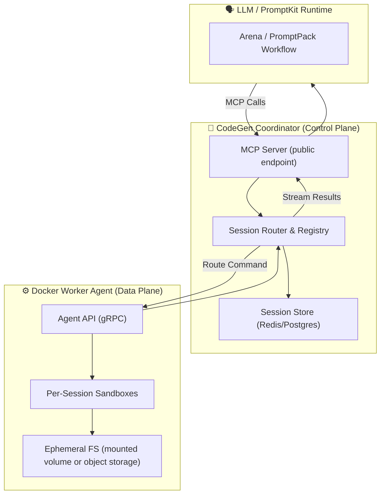

# AltairaLabs CodeGen MCP

> **Distributed sandbox and Model Context Protocol (MCP) provider for LLM-driven code generation and testing.**

<!-- Build & Quality Badges -->

<!-- Security & Compliance Badges -->

<!-- Version & Distribution Badges -->

<!-- License & Status Badges -->

---

### 🧩 Overview

AltairaLabs CodeGen MCP is an open-source **distributed execution layer** that allows LLMs to safely generate, edit, and test code inside isolated sandboxes — all via the [Model Context Protocol (MCP)](https://github.com/anthropics/mcp).

It provides an **MCP provider and runtime** that works like a lightweight CI system for agents:
- Coordinated pool of **Docker-based worker agents**
- **Coordinator service** exposing the MCP endpoint
- Safe, ephemeral **code sandboxes**
- Optional **shared filesystem or object store** for recovery
- Direct integration with **PromptKit / Arena** workflows

---

### 🏗️ Architecture

