# AltairaLabs CodeGen MCP

> **Distributed sandbox and Model Context Protocol (MCP) provider for LLM-driven code generation and testing.**

<!-- Build & Quality Badges -->
[](https://github.com/AltairaLabs/CodeGen-MCP/actions/workflows/ci.yml)
[](https://sonarcloud.io/summary/new_code?id=AltairaLabs_CodeGen-MCP)
[](https://sonarcloud.io/summary/new_code?id=AltairaLabs_CodeGen-MCP)
[](https://goreportcard.com/report/github.com/AltairaLabs/CodeGen-MCP)

<!-- Security & Compliance Badges -->
[](https://sonarcloud.io/summary/new_code?id=AltairaLabs_CodeGen-MCP)
[](https://sonarcloud.io/summary/new_code?id=AltairaLabs_CodeGen-MCP)
[](https://sonarcloud.io/summary/new_code?id=AltairaLabs_CodeGen-MCP)

<!-- Version & Distribution Badges -->
[](https://pkg.go.dev/github.com/AltairaLabs/CodeGen-MCP)

<!-- License & Status Badges -->
[](https://opensource.org/licenses/Apache-2.0)
[](https://go.dev/dl/)
[]()


---

### 🧩 Overview

AltairaLabs CodeGen MCP is an open-source **distributed execution layer** that allows LLMs to safely generate, edit, and test code inside isolated sandboxes — all via the [Model Context Protocol (MCP)](https://github.com/anthropics/mcp).

It provides an **MCP provider and runtime** that works like a lightweight CI system for agents:
- Coordinated pool of **Docker-based worker agents**
- **Coordinator service** exposing the MCP endpoint
- Safe, ephemeral **code sandboxes**
- Optional **shared filesystem or object store** for recovery
- Direct integration with **PromptKit / Arena** workflows

---

### 🏗️ Architecture

```mermaid
flowchart TB
    subgraph Coordinator["🧠 CodeGen Coordinator (Control Plane)"]
        MCP["MCP Server (public endpoint)"]
        Router["Session Router & Registry"]
        Store["Session Store (Redis/Postgres)"]
    end

    subgraph Worker["⚙️ Docker Worker Agent (Data Plane)"]
        API["Agent API (gRPC)"]
        Sandbox["Per-Session Sandboxes"]
        Vol["Ephemeral FS (mounted volume or object storage)"]
    end

    subgraph Client["🗣️ LLM / PromptKit Runtime"]
        Arena["Arena / PromptPack Workflow"]
    end

    Client -->|"MCP Calls"| MCP
    MCP --> Router
    Router -->|Route Command| API
    API --> Sandbox
    Sandbox --> Vol
    API --> Router
    Router --> Store
    Router -->|Stream Results| MCP
    MCP --> Client
```



---

### 🛠️ Development

#### 📖 **[Docker Compose Getting Started Guide](./docs/guides/docker-compose-getting-started.md)**

**Complete deployment guide with:**
- 🚀 Quick start instructions
- 📊 Architecture diagrams  
- ⚙️ Configuration options
- 🧪 Testing and troubleshooting
- 🔧 Development workflow

#### Quick Start

```bash
# Clone the repository
git clone https://github.com/AltairaLabs/codegen-mcp.git
cd codegen-mcp

# Run the full CI pipeline locally
make ci
```

#### Available Make Targets

```bash
make help              # Show all available targets
make install           # Install dependencies and protoc plugins
make build             # Build coordinator and worker binaries
make test              # Run all tests
make test-unit         # Run tests with coverage (used in CI)
make lint              # Run linters (development mode)
make lint-ci           # Run linters in strict mode (used in CI)
make coverage          # Generate coverage report
make ci                # Run full CI pipeline locally
make clean             # Clean build artifacts
```

#### CI Pipeline

The GitHub Actions CI pipeline uses make targets for consistency:

1. **Test Job**: `make install` → `make test-unit`
2. **Lint Job**: `make install` → `make lint-ci`
3. **Build Job**: `make install` → `make build`

**To emulate the CI pipeline locally**, simply run:

```bash
make ci
```

This runs the same steps as CI:
- Install dependencies
- Build binaries
- Run tests with coverage
- Run linters in strict mode

#### Prerequisites

- **Go 1.25+**
- **Protocol Buffers compiler** (`protoc`)
- **golangci-lint** for linting

#### Coverage

Current test coverage: **~85%**

```bash
make coverage
```

View detailed coverage:
```bash
go tool cover -html=coverage.out
```

---

### 📚 Documentation

For detailed documentation, see:

- **[docs/](./docs/)** - Complete documentation
- **[docs/coordinator/](./docs/coordinator/)** - Coordinator documentation
- **[docs/worker/](./docs/worker/)** - Worker documentation
- **[docs/local-backlog/e2e-test-proposal.md](./docs/local-backlog/e2e-test-proposal.md)** - E2E testing implementation

---

### 📄 License

Apache 2.0 - See [LICENSE](./LICENSE) for details

Copyright © 2025 AltairaLabs.ai
