# AltairaLabs CodeGen MCP

> **Distributed sandbox and Model Context Protocol (MCP) provider for LLM-driven code generation and testing.**

---

### 🧩 Overview

AltairaLabs CodeGen MCP is an open-source **distributed execution layer** that allows LLMs to safely generate, edit, and test code inside isolated sandboxes — all via the [Model Context Protocol (MCP)](https://github.com/anthropics/mcp).

It provides an **MCP provider and runtime** that works like a lightweight CI system for agents:
- Coordinated pool of **Docker-based worker agents**
- **Coordinator service** exposing the MCP endpoint
- Safe, ephemeral **code sandboxes**
- Optional **shared filesystem or object store** for recovery
- Direct integration with **PromptKit / Arena** workflows

---

### 🏗️ Architecture

```mermaid
flowchart TB
    subgraph Coordinator["🧠 CodeGen Coordinator (Control Plane)"]
        MCP["MCP Server (public endpoint)"]
        Router["Session Router & Registry"]
        Store["Session Store (Redis/Postgres)"]
    end

    subgraph Worker["⚙️ Docker Worker Agent (Data Plane)"]
        API["Agent API (gRPC)"]
        Sandbox["Per-Session Sandboxes"]
        Vol["Ephemeral FS (mounted volume or object storage)"]
    end

    subgraph Client["🗣️ LLM / PromptKit Runtime"]
        Arena["Arena / PromptPack Workflow"]
    end

    Client -->|"MCP Calls"| MCP
    MCP --> Router
    Router -->|Route Command| API
    API --> Sandbox
    Sandbox --> Vol
    API --> Router
    Router --> Store
    Router -->|Stream Results| MCP
    MCP --> Client
```

