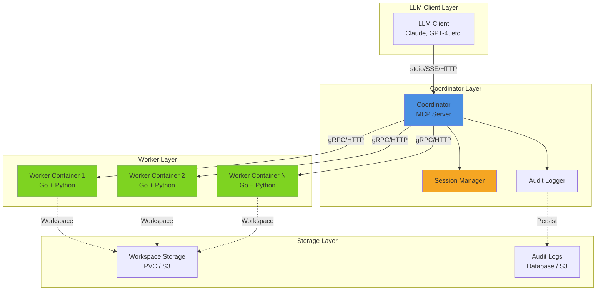

# CodeGen-MCP Documentation

Welcome to the CodeGen-MCP documentation. This guide covers architecture, deployment, API reference, and testing for all components.

## 📚 Documentation Structure

### [Coordinator](./coordinator/)

The Coordinator is the central MCP server that orchestrates code generation workflows.

- **[Architecture Overview](./coordinator/README.md)** - Component design, security model, and extensibility
- **[API Reference](./coordinator/api-reference.md)** - Complete API documentation with examples
- **[Deployment Guide](./coordinator/deployment.md)** - Docker, Kubernetes, and production deployment
- **[Testing Guide](./coordinator/testing.md)** - Test strategies and coverage

**Status:** ✅ Implemented (v0.1.0, 80% overall coverage)

### [Worker](./worker/)

The Worker executes code generation tasks inside secure Python environments.

- **[Architecture Overview](./worker/README.md)** - Component design and communication protocols
- **[API Reference](./worker/api-reference.md)** - gRPC/HTTP API documentation
- **[Deployment Guide](./worker/deployment.md)** - Container configuration and Kubernetes manifests
- **[Testing Guide](./worker/testing.md)** - Unit and integration tests

**Status:** ✅ Implemented (v0.1.0, 80% overall coverage)

### Builder Container (Coming Soon)

The Builder Container provides reproducible Python execution environments.

- Dockerfile Reference - Multi-stage build and dependencies
- Environment Configuration - Python packages and tools
- Security Model - Isolation and sandboxing
- Customization Guide - Extending the base image

**Status:** ⏳ Planned

## 🚀 Quick Start

### **👉 [Docker Compose Getting Started Guide](./guides/docker-compose-getting-started.md)** 

**Recommended for new users!** Comprehensive guide with:
- Step-by-step deployment instructions
- Architecture diagrams and configurations
- Multi-worker setup and testing
- Troubleshooting and performance tuning

### Local Development

```bash
# Clone repository
git clone https://github.com/AltairaLabs/codegen-mcp.git
cd codegen-mcp

# Build all components
make build

# Run coordinator
./bin/coordinator --debug

# Run tests
make test

# Check code quality
make lint
```

### Docker Deployment (Quick)

```bash
# Build and start services (1 coordinator + 1 worker)
make docker-build
make docker-up

# Run integration tests
make docker-test

# View logs
make docker-logs
```

### Multi-Worker Setup

```bash
# Start with 2 workers
make docker-up-multi

# Test session distribution and isolation
make docker-test-multi
```

## 🏗️ System Architecture



### Component Flow

1. **LLM Client** sends MCP tool call to Coordinator via stdio/HTTP
2. **Coordinator** validates request, creates/retrieves session
3. **Session Manager** provides workspace isolation context
4. **Coordinator** routes task to available Worker container
5. **Worker** executes tool in isolated Python environment
6. **Worker** returns result to Coordinator
7. **Coordinator** logs to Audit Logger for provenance
8. **Coordinator** returns result to LLM Client via MCP protocol

## 🔧 Core Concepts

### Model Context Protocol (MCP)

CodeGen-MCP implements the [Model Context Protocol](https://spec.modelcontextprotocol.io/), enabling LLMs to:

- Execute code generation workflows
- Read and write files in isolated workspaces
- Install dependencies and run tests
- Maintain session state across interactions

### Workspace Isolation

Each LLM session gets an isolated workspace:

- **Unique WorkspaceID** - Logical boundary for files and operations
- **Path Validation** - Prevents directory traversal and escapes
- **Resource Limits** - CPU, memory, and disk quotas
- **Ephemeral Storage** - Cleaned up after session expires

### Security Model

Multi-layered security approach:

1. **Path Validation** - All file operations validated before execution
2. **Container Isolation** - Workers run in isolated containers
3. **Non-Root Execution** - All processes run as unprivileged users
4. **Audit Logging** - Complete provenance trail of all operations
5. **Network Policies** - Kubernetes network segmentation
6. **Resource Limits** - Prevents resource exhaustion attacks

## 📖 MCP Tools

### Current Tools (v0.1.0)

| Tool | Description | Arguments |
|------|-------------|-----------|
| `echo` | Echo message (test tool) | `message: string` |
| `fs.read` | Read file from workspace | `path: string` |
| `fs.write` | Write file to workspace | `path: string, content: string` |
| `fs.list` | List files and directories | `path: string` (optional) |
| `run.python` | Execute Python code or file | `code: string` or `file: string` |
| `pkg.install` | Install Python packages | `packages: string` |
| `artifact.get` | Retrieve generated artifact | `artifact_id: string` |
| `task.get_result` | Get task result | `task_id: string` |
| `task.get_status` | Get task status | `task_id: string` |

### Planned Tools

| Tool | Description | Status |
|------|-------------|--------|
| `test.run` | Run test suites | ⏳ Planned |
| `lint.check` | Run linters/type checkers | ⏳ Planned |
| `git.clone` | Clone repository | ⏳ Planned |
| `git.commit` | Commit changes | ⏳ Planned |
| `artifact.list` | List session artifacts | ⏳ Planned |
| `artifact.upload` | Upload artifact to storage | ⏳ Planned |

## 🔍 Component Status

| Component | Version | Status | Description |
|-----------|---------|--------|-------------|
| Coordinator | v0.1.0 | ✅ Stable | Central orchestrator for session and task management (80% coverage) |
| Worker | v0.1.0 | ✅ Stable | Python code execution with venv isolation (80% coverage) |
| Docker Compose | v0.1.0 | ✅ Stable | Multi-worker deployment with session distribution |
| Integration Tests | v0.1.0 | ✅ Complete | Docker-based end-to-end testing (see tests/e2e/) |
| Kubernetes | - | ⏳ Planned | Production orchestration |

## 📊 Quality Metrics

Current test coverage: **80%** (unit tests, excludes infrastructure code)

All quality metrics are tracked in SonarQube:

- **Test Coverage**: See [SonarQube Dashboard](https://sonarcloud.io/project/overview?id=AltairaLabs_CodeGen-MCP)
- **Code Quality**: Automated analysis on every commit
- **Security Scanning**: gosec + SonarQube security rules

### CI/CD

- **Linting**: 24+ golangci-lint rules enabled (`.golangci.yml`)
- **Testing**: Automated unit + integration tests
- **Coverage**: Excludes generated proto files, main.go entrypoints, and infrastructure code
- **Integration**: Full Docker Compose e2e test suite

## 🛠️ Development

### Prerequisites

- Go 1.25+
- Docker 20.10+
- Kubernetes 1.28+ (for production)
- make

### Building

```bash
# Build all binaries
make build

# Build specific component
go build -o bin/coordinator ./cmd/coordinator

# Build Docker images
make docker-build
```

### Testing

```bash
# Run all tests
make test

# Run with coverage
make coverage

# Run linting
make lint

# Run full CI pipeline locally
make ci

# Run specific component tests
go test -v ./internal/coordinator/...
```

### Code Quality

```bash
# Format code
make fmt

# Run all quality checks
make ci
```

## 📝 Contributing

We welcome contributions! Please see:

- [CONTRIBUTING.md](../CONTRIBUTING.md) - Contribution guidelines
- [CODE_OF_CONDUCT.md](../CODE_OF_CONDUCT.md) - Community standards
- [.github/pull_request_template.md](../.github/pull_request_template.md) - PR checklist

### Development Workflow

1. Fork the repository
2. Create a feature branch (`git checkout -b feature/amazing-feature`)
3. Write tests for your changes
4. Ensure all tests pass (`make test`)
5. Lint your code (`make lint`)
6. Commit changes (`git commit -m 'Add amazing feature'`)
7. Push to branch (`git push origin feature/amazing-feature`)
8. Open a Pull Request

## 🔗 Resources

### External Documentation

- [Model Context Protocol Specification](https://spec.modelcontextprotocol.io/)
- [mcp-go Library](https://github.com/mark3labs/mcp-go)
- [Kubernetes Documentation](https://kubernetes.io/docs/)
- [Docker Documentation](https://docs.docker.com/)

### Related Projects

- [PromptKit](https://github.com/AltairaLabs/promptkit-public) - Prompt engineering framework
- [Arena](https://github.com/AltairaLabs/arena) - LLM evaluation platform

## 📧 Support

- **GitHub Issues:** [Report bugs and request features](https://github.com/AltairaLabs/codegen-mcp/issues)
- **GitHub Discussions:** [Ask questions and share ideas](https://github.com/AltairaLabs/codegen-mcp/discussions)
- **Documentation:** You're reading it!

## 📄 License

Apache 2.0 - See [LICENSE](../LICENSE) for details

Copyright © 2025 AltairaLabs.ai

---

**Built with ❤️ by the AltairaLabs team**
