# RFC-0001: Initial Architecture for AltairaLabs CodeGen MCP

## Summary

This RFC proposes the initial architecture for the AltairaLabs CodeGen MCP project, a distributed sandbox and Model Context Protocol (MCP) provider for LLM-driven code geenration, validation, and testing.

## Motivation

LLM-native agents require a secure, scalable, and observable environment to generate, execute, and validate code. Existing CI/CD runners are not designed for LLM workflows, and lack the protocol-level integration needed for agentic orchestration.

## Goals
- Provide a distributed, Docker-based sandbox execution environment
- Expose an MCP-compatible API for LLMs and agent frameworks
- Support ephemeral, isolated code execution with optional persistent storage
- Enable easy integration with PromptKit, Arena, and other LLM agent tools

## Architecture Overview

- **Coordinator**: Exposes the MCP endpoint, manages sessions, routes commands, and tracks state.
- **Worker Agents**: Run in Docker containers, execute code, and report results.
- **Session Store**: (Redis/Postgres) Tracks session state and enables recovery.
- **Sandbox**: Each code execution happens in an isolated, ephemeral environment.

## Diagram

```mermaid
flowchart TB
    subgraph Coordinator["🧠 CodeGen Coordinator (Control Plane)"]
        MCP["MCP Server (public endpoint)"]
        Router["Session Router & Registry"]
        Store["Session Store (Redis/Postgres)"]
    end

    subgraph Worker["⚙️ Docker Worker Agent (Data Plane)"]
        API["Agent API (gRPC)"]
        Sandbox["Per-Session Sandboxes"]
        Vol["Ephemeral FS (mounted volume or object storage)"]
    end

    subgraph Client["🗣️ LLM / PromptKit Runtime"]
        Arena["Arena / PromptPack Workflow"]
    end

    Client -->|"MCP Calls"| MCP
    MCP --> Router
    Router -->|Route Command| API
    API --> Sandbox
    Sandbox --> Vol
    API --> Router
    Router --> Store
    Router -->|Stream Results| MCP
    MCP --> Client
```

## Future Work
- Add support for additional isolation technologies (e.g., Firecracker, gVisor)
- Pluggable storage backends
- Advanced observability and tracing
- Multi-language support
