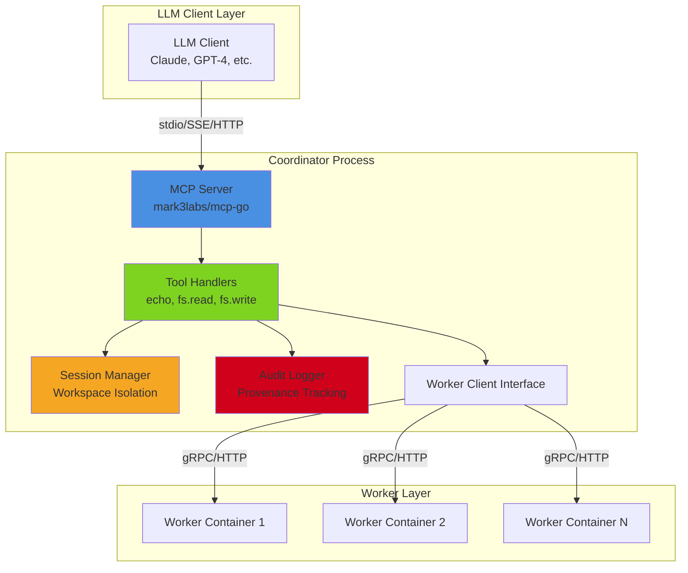
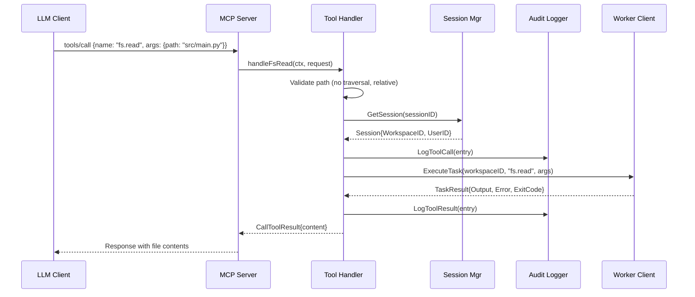
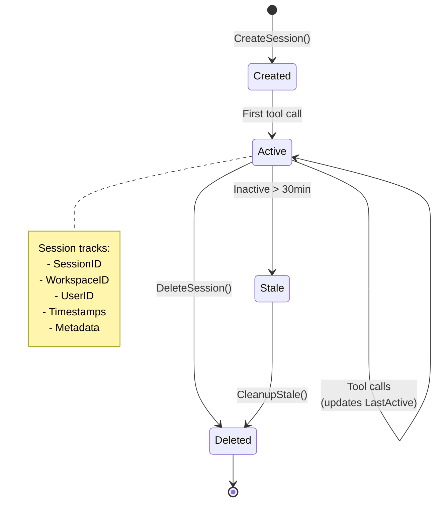
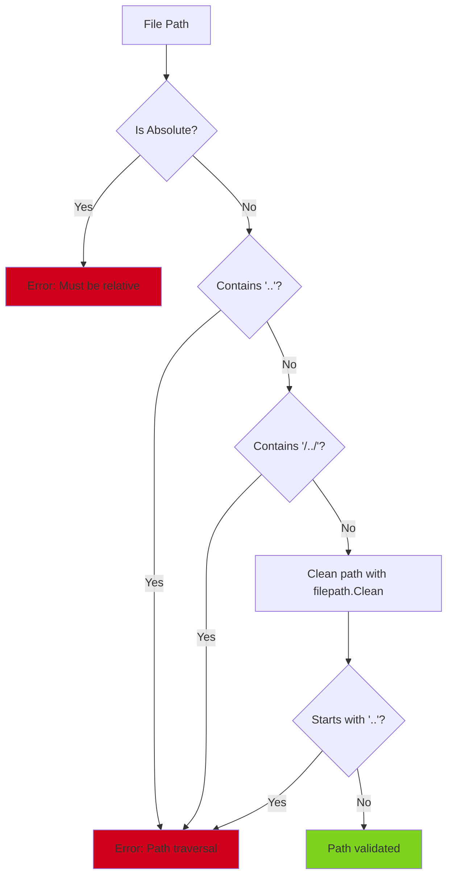
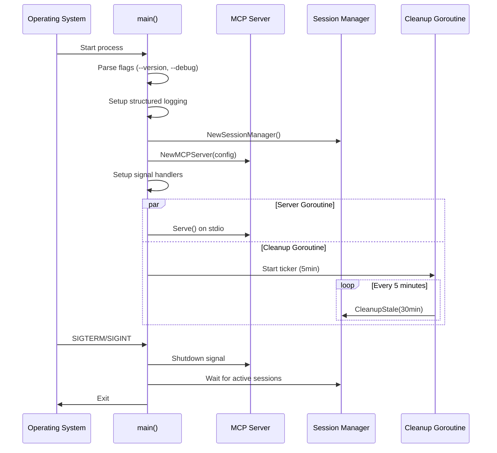

# Coordinator Architecture

The Coordinator is the central orchestration component of CodeGen-MCP, serving as a Model Context Protocol (MCP) server that bridges LLM clients with secure Python execution environments.

## Overview

The Coordinator acts as a long-lived MCP server that:

- **Accepts MCP tool calls** from LLM clients (Claude, GPT-4, etc.)
- **Manages session lifecycle** with workspace isolation
- **Routes tasks** to Worker containers for execution
- **Enforces security policies** through path validation and audit logging
- **Maintains provenance** of all operations for compliance

## Architecture Diagram



## Component Details

### 1. MCP Server (`internal/coordinator/server.go`)

The MCP Server handles protocol communication and tool registration.

**Key Responsibilities:**
- Tool registration and schema definition
- Request validation and parsing
- Response formatting per MCP protocol
- Transport abstraction (stdio, SSE, HTTP)

**Current Tools:**
- `echo` - Test tool for message echoing
- `fs.read` - Read files from workspace
- `fs.write` - Write files to workspace

**Tool Flow:**



### 2. Session Manager (`internal/coordinator/session.go`)

Manages isolated sessions for each MCP client connection.

**Session Lifecycle:**



**Key Features:**
- Thread-safe session storage with RWMutex
- Automatic cleanup of stale sessions (default: 30 minutes)
- Per-session workspace isolation
- Metadata support for custom attributes

### 3. Worker Client Interface (`internal/coordinator/worker.go`)

Abstract interface for task execution with workers.

**Interface Contract:**

```go
type WorkerClient interface {
    ExecuteTask(ctx context.Context, 
                workspaceID string, 
                toolName string, 
                args TaskArgs) (*TaskResult, error)
}
```

**Current Implementation:**
- `MockWorkerClient` - In-memory mock for testing
- Future: `GRPCWorkerClient` - Production gRPC client
- Future: `HTTPWorkerClient` - HTTP fallback

### 4. Audit Logger (`internal/coordinator/worker.go`)

Provides comprehensive audit trail for compliance and debugging.

**Audit Entry Structure:**

```go
type AuditEntry struct {
    Timestamp   time.Time
    SessionID   string
    UserID      string
    ToolName    string
    Arguments   map[string]interface{}
    Result      *TaskResult
    ErrorMsg    string
    TraceID     string
    WorkspaceID string
}
```

**Logged Events:**
- Tool call initiation (with arguments)
- Tool completion (with results)
- Errors and failures
- Session lifecycle events

## Security Model

### Path Validation

All file system operations enforce strict path validation:



**Validation Rules:**
1. Paths must be relative (no absolute paths)
2. No parent directory traversal (`..` or `/../`)
3. Paths cleaned with `filepath.Clean()`
4. Workspace-scoped execution

### Session Isolation

Each session maintains:
- **Unique SessionID** - Identifies client connection
- **WorkspaceID** - Logical workspace boundary
- **UserID** - Client identity for audit
- **Isolated state** - No cross-session data leakage

## Configuration

### Server Configuration

```go
type Config struct {
    Name    string  // Service identifier
    Version string  // Semantic version
}
```

### Runtime Settings

| Setting | Default | Description |
|---------|---------|-------------|
| Session Max Age | 30 minutes | Auto-cleanup threshold |
| Cleanup Interval | 5 minutes | Session cleanup frequency |
| Log Level | INFO | Structured logging level |
| Transport | stdio | MCP transport (stdio/SSE/HTTP) |

## Deployment

### Process Lifecycle



### Command-Line Interface

```bash
# Start coordinator with default settings
./coordinator

# Enable debug logging
./coordinator --debug

# Print version
./coordinator --version
```

### Environment Variables

Currently, the Coordinator uses minimal configuration. Future versions will support:

- `COORDINATOR_WORKER_URL` - Worker service endpoint
- `COORDINATOR_LOG_LEVEL` - Logging verbosity
- `COORDINATOR_SESSION_TTL` - Session timeout
- `COORDINATOR_AUDIT_BACKEND` - Audit storage backend

## Extensibility

### Adding New Tools

To add a new MCP tool:

1. **Define Tool Schema:**
```go
newTool := mcp.NewTool("tool.name",
    mcp.WithDescription("Tool description"),
    mcp.WithString("param1", mcp.Required(), mcp.Description("...")),
)
```

2. **Register Handler:**
```go
ms.server.AddTool(newTool, ms.handleNewTool)
```

3. **Implement Handler:**
```go
func (ms *MCPServer) handleNewTool(ctx context.Context, 
                                    request mcp.CallToolRequest) (*mcp.CallToolResult, error) {
    // 1. Validate parameters
    // 2. Get session
    // 3. Audit log
    // 4. Execute via worker
    // 5. Return result
}
```

### Custom Worker Clients

Implement the `WorkerClient` interface:

```go
type CustomWorkerClient struct {
    endpoint string
    client   *http.Client
}

func (c *CustomWorkerClient) ExecuteTask(ctx context.Context, 
                                         workspaceID string, 
                                         toolName string, 
                                         args TaskArgs) (*TaskResult, error) {
    // Custom implementation (HTTP, gRPC, etc.)
}
```

## Testing

The Coordinator has 87.6% test coverage across components:

- **server_test.go** - Tool handlers and validation
- **session_test.go** - Session lifecycle (100% coverage)
- **worker_test.go** - Worker client interface (88.9% coverage)
- **types_test.go** - Type definitions (100% coverage)

### Running Tests

```bash
# Run all tests
make test

# Run with coverage
go test -v -race -coverprofile=coverage.out ./internal/coordinator/...

# View coverage report
go tool cover -html=coverage.out
```

## Observability

### Structured Logging

All logs use structured JSON format via `slog`:

```json
{
  "time": "2025-11-08T12:34:56.789Z",
  "level": "INFO",
  "msg": "Tool call received",
  "session_id": "sess-abc123",
  "tool_name": "fs.read",
  "workspace_id": "ws-xyz789"
}
```

### Audit Trail

Every tool invocation creates two audit entries:

1. **Tool Call** - Before execution
2. **Tool Result** - After completion

This provides:
- Complete provenance trail
- Error tracking
- Performance metrics (via Duration)
- Compliance audit capability

## Performance Characteristics

- **Concurrency:** Thread-safe session management with RWMutex
- **Memory:** Minimal footprint, sessions cleaned up automatically
- **Latency:** Sub-millisecond tool routing (excludes worker execution)
- **Throughput:** Limited by worker pool capacity

## Future Enhancements

### Planned Features

1. **Enhanced Worker Pool Management**
   - Dynamic worker scaling
   - Load balancing across workers
   - Health checks and failover

2. **Advanced Security**
   - Resource limits per session
   - Rate limiting per user
   - Network policy enforcement

3. **Persistent Storage**
   - Audit log to database/S3
   - Session recovery after restart
   - Workspace persistence

4. **Additional Tools**
   - `run.python` - Execute Python code
   - `pkg.install` - Install dependencies
   - `test.run` - Run test suites
   - `lint.check` - Code quality checks

5. **Monitoring**
   - Prometheus metrics
   - OpenTelemetry tracing
   - Health check endpoints

## Related Documentation

- [Worker Architecture](../worker/README.md) (Coming Soon)
- [MCP Protocol Specification](https://spec.modelcontextprotocol.io/)
- [API Reference](./api-reference.md) (Coming Soon)
- [Deployment Guide](./deployment.md) (Coming Soon)
