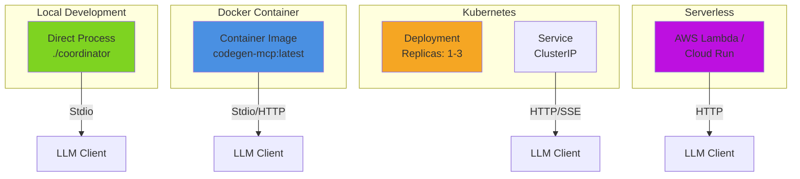

# Coordinator Deployment Guide

Guide for deploying the CodeGen-MCP Coordinator in various environments.

## Deployment Patterns

The Coordinator supports multiple deployment patterns depending on your infrastructure:



## Local Development

### Direct Execution

The simplest deployment for development:

```bash
# Build the coordinator
make build

# Run with default settings
./bin/coordinator

# Run with debug logging
./bin/coordinator --debug
```

**Configuration:**

| Environment Variable | Default | Description |
|---------------------|---------|-------------|
| `LOG_LEVEL` | `info` | Logging level (debug, info, warn, error) |
| `SESSION_MAX_AGE` | `30m` | Session timeout duration |
| `CLEANUP_INTERVAL` | `5m` | Session cleanup frequency |

### Docker Compose

For local development with workers:

```yaml
# docker-compose.yml
version: '3.8'

services:
  coordinator:
    build:
      context: .
      dockerfile: docker/coordinator/Dockerfile
    ports:
      - "8080:8080"
    environment:
      - LOG_LEVEL=debug
      - WORKER_URL=http://worker:8081
    volumes:
      - ./workspaces:/workspaces
    networks:
      - codegen-net

  worker:
    build:
      context: .
      dockerfile: docker/builder/Dockerfile
    environment:
      - COORDINATOR_URL=http://coordinator:8080
      - WORKER_ID=worker-1
    volumes:
      - ./workspaces:/workspaces
    networks:
      - codegen-net

networks:
  codegen-net:
    driver: bridge
```

**Start services:**

```bash
docker-compose up -d
docker-compose logs -f coordinator
```

## Kubernetes Deployment

### Deployment Manifest

```yaml
# k8s/coordinator-deployment.yaml
apiVersion: apps/v1
kind: Deployment
metadata:
  name: codegen-coordinator
  namespace: codegen-mcp
  labels:
    app: coordinator
    version: v0.1.0
spec:
  replicas: 2
  strategy:
    type: RollingUpdate
    rollingUpdate:
      maxSurge: 1
      maxUnavailable: 0
  selector:
    matchLabels:
      app: coordinator
  template:
    metadata:
      labels:
        app: coordinator
        version: v0.1.0
      annotations:
        prometheus.io/scrape: "true"
        prometheus.io/port: "9090"
    spec:
      serviceAccountName: coordinator
      containers:
      - name: coordinator
        image: codegen-mcp/coordinator:v0.1.0
        imagePullPolicy: IfNotPresent
        ports:
        - name: http
          containerPort: 8080
          protocol: TCP
        - name: metrics
          containerPort: 9090
          protocol: TCP
        env:
        - name: LOG_LEVEL
          value: "info"
        - name: WORKER_URL
          value: "http://worker-service:8081"
        - name: SESSION_MAX_AGE
          value: "30m"
        - name: CLEANUP_INTERVAL
          value: "5m"
        resources:
          requests:
            cpu: 100m
            memory: 128Mi
          limits:
            cpu: 500m
            memory: 512Mi
        livenessProbe:
          httpGet:
            path: /healthz
            port: 8080
          initialDelaySeconds: 10
          periodSeconds: 30
        readinessProbe:
          httpGet:
            path: /ready
            port: 8080
          initialDelaySeconds: 5
          periodSeconds: 10
        securityContext:
          runAsNonRoot: true
          runAsUser: 1000
          readOnlyRootFilesystem: true
          allowPrivilegeEscalation: false
          capabilities:
            drop:
            - ALL
      affinity:
        podAntiAffinity:
          preferredDuringSchedulingIgnoredDuringExecution:
          - weight: 100
            podAffinityTerm:
              labelSelector:
                matchExpressions:
                - key: app
                  operator: In
                  values:
                  - coordinator
              topologyKey: kubernetes.io/hostname
```

### Service Manifest

```yaml
# k8s/coordinator-service.yaml
apiVersion: v1
kind: Service
metadata:
  name: coordinator-service
  namespace: codegen-mcp
  labels:
    app: coordinator
spec:
  type: ClusterIP
  selector:
    app: coordinator
  ports:
  - name: http
    port: 8080
    targetPort: http
    protocol: TCP
  - name: metrics
    port: 9090
    targetPort: metrics
    protocol: TCP
  sessionAffinity: ClientIP
  sessionAffinityConfig:
    clientIP:
      timeoutSeconds: 10800  # 3 hours
```

### ServiceAccount & RBAC

```yaml
# k8s/coordinator-rbac.yaml
apiVersion: v1
kind: ServiceAccount
metadata:
  name: coordinator
  namespace: codegen-mcp
---
apiVersion: rbac.authorization.k8s.io/v1
kind: Role
metadata:
  name: coordinator-role
  namespace: codegen-mcp
rules:
- apiGroups: [""]
  resources: ["pods", "pods/log"]
  verbs: ["get", "list", "watch"]
- apiGroups: ["batch"]
  resources: ["jobs"]
  verbs: ["get", "list", "create", "delete"]
---
apiVersion: rbac.authorization.k8s.io/v1
kind: RoleBinding
metadata:
  name: coordinator-rolebinding
  namespace: codegen-mcp
roleRef:
  apiGroup: rbac.authorization.k8s.io
  kind: Role
  name: coordinator-role
subjects:
- kind: ServiceAccount
  name: coordinator
  namespace: codegen-mcp
```

### ConfigMap

```yaml
# k8s/coordinator-configmap.yaml
apiVersion: v1
kind: ConfigMap
metadata:
  name: coordinator-config
  namespace: codegen-mcp
data:
  config.yaml: |
    server:
      name: codegen-mcp-coordinator
      version: 0.1.0
      log_level: info
    
    session:
      max_age: 30m
      cleanup_interval: 5m
    
    worker:
      url: http://worker-service:8081
      timeout: 5m
      max_retries: 3
    
    audit:
      enabled: true
      backend: stdout
      format: json
```

### Deploy to Kubernetes

```bash
# Create namespace
kubectl create namespace codegen-mcp

# Apply manifests
kubectl apply -f k8s/coordinator-rbac.yaml
kubectl apply -f k8s/coordinator-configmap.yaml
kubectl apply -f k8s/coordinator-deployment.yaml
kubectl apply -f k8s/coordinator-service.yaml

# Verify deployment
kubectl get pods -n codegen-mcp -l app=coordinator
kubectl logs -n codegen-mcp -l app=coordinator --tail=50

# Check service
kubectl get svc -n codegen-mcp coordinator-service
```

## Container Image

### Dockerfile

```dockerfile
# docker/coordinator/Dockerfile
FROM golang:1.25-alpine AS builder

WORKDIR /build

# Copy go mod files
COPY go.mod go.sum ./
RUN go mod download

# Copy source code
COPY cmd/coordinator/ ./cmd/coordinator/
COPY internal/coordinator/ ./internal/coordinator/

# Build binary
RUN CGO_ENABLED=0 GOOS=linux GOARCH=amd64 go build \
    -ldflags="-w -s -X main.version=0.1.0" \
    -o coordinator \
    ./cmd/coordinator

# Final stage
FROM alpine:3.19

# Install ca-certificates for HTTPS
RUN apk --no-cache add ca-certificates

# Create non-root user
RUN addgroup -g 1000 coordinator && \
    adduser -D -u 1000 -G coordinator coordinator

WORKDIR /app

# Copy binary from builder
COPY --from=builder /build/coordinator /app/coordinator

# Change ownership
RUN chown -R coordinator:coordinator /app

USER coordinator

EXPOSE 8080 9090

ENTRYPOINT ["/app/coordinator"]
```

### Build and Push

```bash
# Build image
docker build -f docker/coordinator/Dockerfile -t codegen-mcp/coordinator:v0.1.0 .

# Tag for registry
docker tag codegen-mcp/coordinator:v0.1.0 registry.example.com/codegen-mcp/coordinator:v0.1.0

# Push to registry
docker push registry.example.com/codegen-mcp/coordinator:v0.1.0
```

## Production Considerations

### High Availability

```yaml
# HA Configuration
replicas: 3  # Multiple replicas for redundancy

# Pod Disruption Budget
apiVersion: policy/v1
kind: PodDisruptionBudget
metadata:
  name: coordinator-pdb
  namespace: codegen-mcp
spec:
  minAvailable: 2
  selector:
    matchLabels:
      app: coordinator
```

### Resource Limits

**Recommendations:**

| Deployment Size | CPU Request | CPU Limit | Memory Request | Memory Limit |
|----------------|-------------|-----------|----------------|--------------|
| Small (< 10 clients) | 100m | 500m | 128Mi | 512Mi |
| Medium (10-50 clients) | 250m | 1000m | 256Mi | 1Gi |
| Large (50+ clients) | 500m | 2000m | 512Mi | 2Gi |

### Session Persistence

For production deployments, consider external session storage:

```go
// Example: Redis-backed session manager
type RedisSessionManager struct {
    client *redis.Client
}

func (rsm *RedisSessionManager) CreateSession(...) {
    // Store session in Redis with TTL
    rsm.client.Set(ctx, sessionKey, sessionData, 30*time.Minute)
}
```

### Audit Log Storage

Configure persistent audit logging:

```yaml
# Mount for audit logs
volumes:
- name: audit-logs
  persistentVolumeClaim:
    claimName: coordinator-audit-pvc

volumeMounts:
- name: audit-logs
  mountPath: /var/log/audit
```

### Monitoring

**Prometheus ServiceMonitor:**

```yaml
apiVersion: monitoring.coreos.com/v1
kind: ServiceMonitor
metadata:
  name: coordinator-metrics
  namespace: codegen-mcp
spec:
  selector:
    matchLabels:
      app: coordinator
  endpoints:
  - port: metrics
    interval: 30s
    path: /metrics
```

**Key Metrics to Monitor:**

- `coordinator_sessions_active` - Current active sessions
- `coordinator_sessions_created_total` - Total sessions created
- `coordinator_tool_calls_total` - Tool invocations by type
- `coordinator_tool_duration_seconds` - Tool execution latency
- `coordinator_worker_errors_total` - Worker communication failures

### Logging

**Structured JSON logging:**

```json
{
  "time": "2025-11-08T12:34:56.789Z",
  "level": "INFO",
  "msg": "Tool call completed",
  "session_id": "sess-abc123",
  "tool_name": "fs.read",
  "duration_ms": 150,
  "success": true,
  "workspace_id": "ws-xyz789",
  "trace_id": "trace-abc-def-123"
}
```

**Log aggregation with FluentBit:**

```yaml
# Sidecar for log forwarding
- name: fluentbit
  image: fluent/fluent-bit:2.0
  volumeMounts:
  - name: config
    mountPath: /fluent-bit/etc/
  - name: logs
    mountPath: /var/log/coordinator
```

## Security

### Network Policies

```yaml
apiVersion: networking.k8s.io/v1
kind: NetworkPolicy
metadata:
  name: coordinator-netpol
  namespace: codegen-mcp
spec:
  podSelector:
    matchLabels:
      app: coordinator
  policyTypes:
  - Ingress
  - Egress
  ingress:
  - from:
    - podSelector:
        matchLabels:
          app: llm-client
    ports:
    - protocol: TCP
      port: 8080
  egress:
  - to:
    - podSelector:
        matchLabels:
          app: worker
    ports:
    - protocol: TCP
      port: 8081
```

### Pod Security Policy

```yaml
apiVersion: policy/v1beta1
kind: PodSecurityPolicy
metadata:
  name: coordinator-psp
spec:
  privileged: false
  allowPrivilegeEscalation: false
  requiredDropCapabilities:
  - ALL
  volumes:
  - 'configMap'
  - 'emptyDir'
  - 'secret'
  runAsUser:
    rule: 'MustRunAsNonRoot'
  seLinux:
    rule: 'RunAsAny'
  fsGroup:
    rule: 'RunAsAny'
  readOnlyRootFilesystem: true
```

## Troubleshooting

### Common Issues

**Sessions not persisting:**

```bash
# Check session manager logs
kubectl logs -n codegen-mcp -l app=coordinator | grep -i session

# Verify cleanup interval
kubectl get configmap -n codegen-mcp coordinator-config -o yaml
```

**Worker communication failures:**

```bash
# Test worker connectivity
kubectl exec -n codegen-mcp deploy/codegen-coordinator -- \
  wget -O- http://worker-service:8081/health

# Check network policy
kubectl describe networkpolicy -n codegen-mcp coordinator-netpol
```

**High memory usage:**

```bash
# Check session count
kubectl exec -n codegen-mcp deploy/codegen-coordinator -- \
  curl localhost:8080/debug/sessions

# Profile memory
kubectl port-forward -n codegen-mcp deploy/codegen-coordinator 6060:6060
go tool pprof http://localhost:6060/debug/pprof/heap
```

## See Also

- [Coordinator Architecture](./README.md) - Architecture overview
- [API Reference](./api-reference.md) - Complete API documentation
- [Worker Deployment](../worker/deployment.md) - Worker deployment guide
