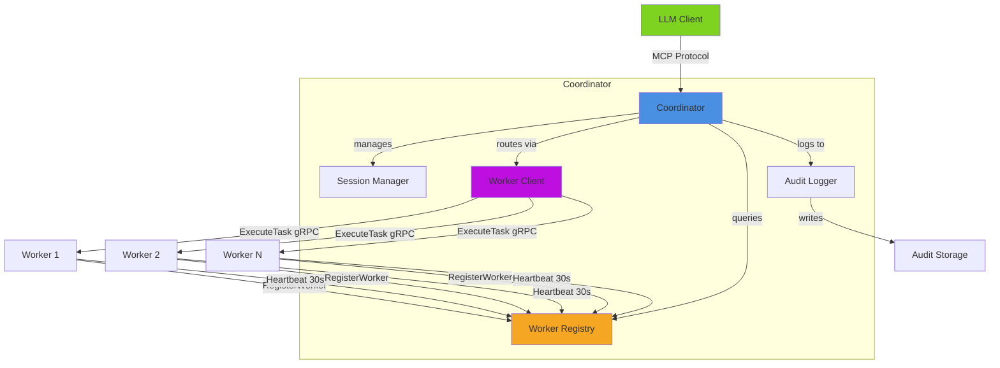

# Coordinator Documentation

Complete documentation for the CodeGen-MCP Coordinator component.

## Quick Links

- **[Architecture Overview](./README.md)** - High-level architecture, components, and design
- **[API Reference](./api-reference.md)** - Complete API documentation and usage examples
- **[Deployment Guide](./deployment.md)** - Deploy to production (Docker, Kubernetes, etc.)
- **[Testing Guide](./testing.md)** - Testing strategies and best practices

## What is the Coordinator?

The Coordinator is a long-lived MCP (Model Context Protocol) server that acts as the central orchestration component of CodeGen-MCP. It:

- **Bridges LLM clients** with secure Python execution environments
- **Manages sessions** with workspace isolation
- **Routes tasks** to Worker containers for execution
- **Enforces security** through path validation and audit logging
- **Maintains provenance** of all operations

## Getting Started

### Prerequisites

- Go 1.25 or later
- Docker (for containerized deployments)
- Kubernetes (for production deployments)

### Quick Start

```bash
# Clone the repository
git clone https://github.com/AltairaLabs/codegen-mcp.git
cd codegen-mcp

# Build the coordinator
make build

# Run locally
./bin/coordinator

# Run with debug logging
./bin/coordinator --debug
```

### Docker

```bash
# Build container image
docker build -f docker/coordinator/Dockerfile -t codegen-mcp/coordinator:latest .

# Run container
docker run -it codegen-mcp/coordinator:latest
```

### Kubernetes

```bash
# Deploy to cluster
kubectl apply -f k8s/coordinator-rbac.yaml
kubectl apply -f k8s/coordinator-deployment.yaml
kubectl apply -f k8s/coordinator-service.yaml

# Check status
kubectl get pods -l app=coordinator
```

## Architecture at a Glance



## Core Features

### MCP Server

- **Protocol Support:** stdio, SSE, HTTP transports
- **Tool Registration:** Dynamic tool schema and handlers
- **Request Validation:** Parameter checking and sanitization
- **Error Handling:** Graceful error propagation to clients

### Session Management

- **Workspace Isolation:** Each session has isolated workspace
- **Worker Assignment:** Sessions assigned to workers with capacity
- **Session-to-Worker Affinity:** Tasks route to session's assigned worker
- **Automatic Cleanup:** Stale sessions removed after configurable timeout
- **Thread-Safe:** Concurrent session access with RWMutex
- **Metadata Support:** Custom key-value pairs per session

### Worker Management

- **Worker Registration:** Workers register at startup via gRPC
- **Heartbeat Monitoring:** Workers send heartbeat every 30 seconds
- **Capacity Tracking:** Tracks active sessions per worker
- **Stale Worker Cleanup:** Removes workers with no heartbeat for 5 minutes
- **Worker Registry:** Thread-safe registry with capacity-aware selection
- **Graceful Deregistration:** Workers deregister on shutdown

### Task Routing

- **Real Worker Client:** Routes tasks to workers via gRPC
- **Session Affinity:** Tasks execute on session's assigned worker
- **Streaming Support:** Real-time logs and progress from workers
- **Connection Management:** Establishes gRPC connections on demand
- **Error Handling:** Handles worker unavailability and connection errors

### Security

- **Path Validation:** Prevents directory traversal and absolute paths
- **Workspace Scoping:** All file operations restricted to workspace
- **Audit Logging:** Complete provenance trail of all operations
- **Non-Root Execution:** Runs as unprivileged user (UID 1000)

### Available Tools

Current MCP tools exposed to LLM clients:

| Tool | Description | Arguments |
|------|-------------|-----------|
| `echo` | Echo message back (test tool) | `message: string` |
| `fs.read` | Read file from workspace | `path: string` |
| `fs.write` | Write file to workspace | `path: string, contents: string` |

See [Architecture Overview](./README.md#exposed-tools-examples) for planned tools.

## Documentation Structure

### [Architecture Overview](./README.md)

Comprehensive architecture documentation including:

- Component diagram and flow
- Detailed component descriptions
- Security model and path validation
- Configuration options
- Extensibility guide

**Recommended for:** Understanding the system design

### [API Reference](./api-reference.md)

Complete API documentation covering:

- MCP Server API
- Session Manager API
- Worker Client interface
- Audit Logger API
- Type definitions and examples

**Recommended for:** Developers integrating or extending the Coordinator

### [Deployment Guide](./deployment.md)

Production deployment patterns:

- Local development setup
- Docker containerization
- Kubernetes manifests (Deployment, Service, RBAC)
- High availability configuration
- Monitoring and observability

**Recommended for:** DevOps and platform engineers

### [Testing Guide](./testing.md)

Testing strategies and coverage:

- Unit test examples
- Integration tests
- Benchmark tests
- CI/CD integration
- Coverage improvement strategies

**Recommended for:** Developers contributing to the project

## Project Status

### Current Version: v0.1.0

**Test Coverage:** 91.7% (target: 95%)

| Component | Coverage |
|-----------|----------|
| session.go | 100% ✅ |
| types.go | 100% ✅ |
| lifecycle_handlers.go | 100% ✅ |
| worker_registry.go | 96.4% ✅ |
| worker.go | 88.9% |
| server.go | 78.3% |

**Build Status:** ✅ All tests passing

### Implemented Features

- ✅ MCP server with stdio transport
- ✅ Session management with automatic cleanup
- ✅ Three core tools (echo, fs.read, fs.write)
- ✅ Path validation and security
- ✅ Structured audit logging
- ✅ Mock worker client for testing
- ✅ **Worker registration and lifecycle management**
- ✅ **Worker registry with capacity-aware selection**
- ✅ **Real worker client with gRPC task routing**
- ✅ **Session-to-worker affinity**
- ✅ **Heartbeat monitoring and stale worker cleanup**
- ✅ Graceful shutdown handling

### Planned Features

- ⏳ Worker gRPC address registration
- ⏳ HTTP/SSE transport support
- ⏳ Additional tools (run.python, pkg.install, test.run)
- ⏳ Prometheus metrics
- ⏳ OpenTelemetry tracing
- ⏳ Redis-backed session storage
- ⏳ Health check endpoints

## Configuration

### Environment Variables

| Variable | Default | Description |
|----------|---------|-------------|
| `LOG_LEVEL` | `info` | Logging level (debug, info, warn, error) |
| `SESSION_MAX_AGE` | `30m` | Session timeout duration |
| `CLEANUP_INTERVAL` | `5m` | Session cleanup frequency |
| `GRPC_PORT` | `50050` | gRPC server port for worker lifecycle |
| `WORKER_HEARTBEAT_TIMEOUT` | `5m` | Maximum time since last heartbeat before worker considered stale |

### Command-Line Flags

```bash
--version    # Print version and exit
--debug      # Enable debug logging
```

## Contributing

Contributions welcome! Please:

1. Read [CONTRIBUTING.md](../../CONTRIBUTING.md)
2. Check existing issues and PRs
3. Follow testing guidelines in [Testing Guide](./testing.md)
4. Ensure 90%+ test coverage for new code
5. Update documentation as needed

## Support

- **Issues:** [GitHub Issues](https://github.com/AltairaLabs/codegen-mcp/issues)
- **Discussions:** [GitHub Discussions](https://github.com/AltairaLabs/codegen-mcp/discussions)
- **Documentation:** [docs/coordinator/](.)

## Related Components

- **[Worker](../worker/)** - Task execution component (coming soon)
- **[Builder Container](../builder/)** - Python execution environment (coming soon)
- **[MCP Protocol](https://spec.modelcontextprotocol.io/)** - Protocol specification

## License

Apache 2.0 - See [LICENSE](../../LICENSE) for details

Copyright © 2025 AltairaLabs.ai
