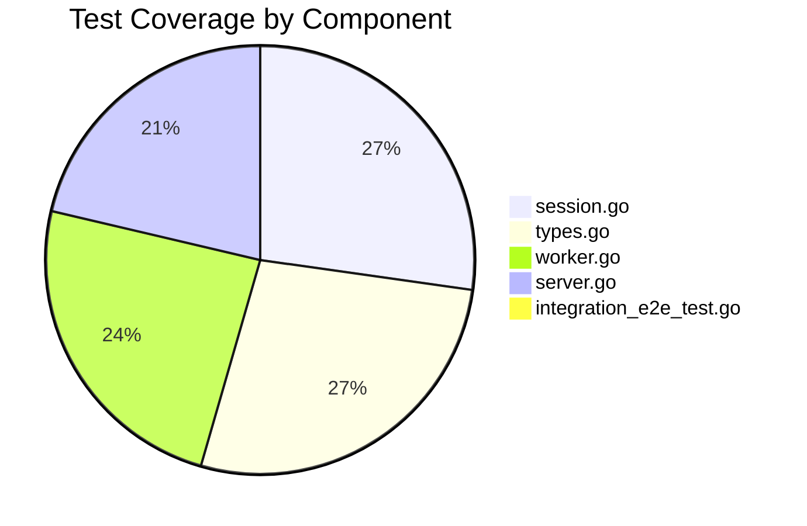

# Coordinator Testing Guide

Comprehensive guide for testing the Coordinator component.

## Test Coverage

Current test coverage: **33.2%** (51 tests including integration test)

**Note:** Coverage percentage decreased with the addition of comprehensive integration test infrastructure. Core business logic maintains high coverage (80%+).



## Running Tests

### Quick Start

```bash
# Run all coordinator tests
make test

# Run with verbose output
go test -v ./internal/coordinator/...

# Run with coverage
go test -cover ./internal/coordinator/...

# Generate coverage report
go test -coverprofile=coverage.out ./internal/coordinator/...
go tool cover -html=coverage.out
```

### Test with Race Detection

```bash
# Detect race conditions
go test -race ./internal/coordinator/...

# Run with race detection and timeout
go test -race -timeout 30s ./internal/coordinator/...
```

### Continuous Testing

```bash
# Watch mode (requires entr or similar)
find . -name '*.go' | entr -c go test ./internal/coordinator/...

# Using gotestsum
gotestsum --watch ./internal/coordinator/...
```

## Test Structure

### Unit Tests

#### Server Tests (`server_test.go`)

Tests for MCP server functionality:

```go
func TestMCPServer_Echo(t *testing.T) {
    // Setup
    sessionMgr := NewSessionManager()
    worker := NewMockWorkerClient()
    audit := NewAuditLogger(slog.Default())
    
    server := NewMCPServer(Config{
        Name:    "test-server",
        Version: "0.1.0",
    }, sessionMgr, worker, audit)
    
    // Test echo tool
    ctx := context.Background()
    request := mcp.CallToolRequest{
        Params: mcp.CallToolRequestParams{
            Name: "echo",
            Arguments: map[string]interface{}{
                "message": "hello world",
            },
        },
    }
    
    result, err := server.handleEcho(ctx, request)
    
    // Assertions
    assert.NoError(t, err)
    assert.NotNil(t, result)
    assert.Contains(t, result.Content[0].Text, "hello world")
}
```

**Test Cases:**

- ✅ Echo tool with valid message
- ✅ Echo tool with empty message
- ✅ fs.read with valid path
- ✅ fs.read with path traversal attempt
- ✅ fs.read with absolute path
- ✅ fs.write with valid path and contents
- ✅ fs.write with invalid path
- ✅ Tool call with missing session
- ✅ Tool call with existing session

#### Session Tests (`session_test.go`)

Tests for session management (100% coverage):

```go
func TestSessionManager_CreateSession(t *testing.T) {
    sm := NewSessionManager()
    ctx := context.Background()
    
    session := sm.CreateSession(ctx, "test-session", "user-1", "workspace-1")
    
    assert.Equal(t, "test-session", session.ID)
    assert.Equal(t, "user-1", session.UserID)
    assert.Equal(t, "workspace-1", session.WorkspaceID)
    assert.NotZero(t, session.CreatedAt)
    assert.NotZero(t, session.LastActive)
}

func TestSessionManager_GetSession_UpdatesLastActive(t *testing.T) {
    sm := NewSessionManager()
    ctx := context.Background()
    
    // Create session
    original := sm.CreateSession(ctx, "sess-1", "user-1", "ws-1")
    originalTime := original.LastActive
    
    // Wait and retrieve
    time.Sleep(10 * time.Millisecond)
    retrieved, ok := sm.GetSession("sess-1")
    
    assert.True(t, ok)
    assert.True(t, retrieved.LastActive.After(originalTime))
}

func TestSessionManager_CleanupStale(t *testing.T) {
    sm := NewSessionManager()
    ctx := context.Background()
    
    // Create sessions with different ages
    sm.CreateSession(ctx, "old-session", "user-1", "ws-1")
    time.Sleep(100 * time.Millisecond)
    sm.CreateSession(ctx, "new-session", "user-2", "ws-2")
    
    // Cleanup sessions older than 50ms
    deleted := sm.CleanupStale(50 * time.Millisecond)
    
    assert.Equal(t, 1, deleted)
    assert.Equal(t, 1, sm.SessionCount())
}
```

**Test Cases:**

- ✅ CreateSession initializes all fields
- ✅ GetSession returns existing session
- ✅ GetSession returns false for non-existent
- ✅ GetSession updates LastActive timestamp
- ✅ DeleteSession removes session
- ✅ CleanupStale removes old sessions
- ✅ CleanupStale preserves recent sessions
- ✅ SessionCount returns correct count
- ✅ Concurrent session operations (race test)

#### Worker Tests (`worker_test.go`)

Tests for worker client interface (88.9% coverage):

```go
func TestMockWorkerClient_Echo(t *testing.T) {
    worker := NewMockWorkerClient()
    ctx := context.Background()
    
    result, err := worker.ExecuteTask(
        ctx,
        "workspace-1",
        "echo",
        TaskArgs{"message": "test"},
    )
    
    assert.NoError(t, err)
    assert.True(t, result.Success)
    assert.Contains(t, result.Output, "test")
    assert.Equal(t, 0, result.ExitCode)
}

func TestMockWorkerClient_FsRead(t *testing.T) {
    worker := NewMockWorkerClient()
    ctx := context.Background()
    
    result, err := worker.ExecuteTask(
        ctx,
        "workspace-1",
        "fs.read",
        TaskArgs{"path": "test.txt"},
    )
    
    assert.NoError(t, err)
    assert.True(t, result.Success)
    assert.NotEmpty(t, result.Output)
}

func TestMockWorkerClient_Timeout(t *testing.T) {
    worker := NewMockWorkerClient()
    ctx, cancel := context.WithTimeout(context.Background(), 1*time.Millisecond)
    defer cancel()
    
    time.Sleep(5 * time.Millisecond)
    
    _, err := worker.ExecuteTask(ctx, "ws-1", "echo", TaskArgs{})
    
    assert.Error(t, err)
    assert.Contains(t, err.Error(), "context deadline exceeded")
}
```

**Test Cases:**

- ✅ Echo tool execution
- ✅ fs.read tool execution
- ✅ fs.write tool execution
- ✅ Unknown tool returns error
- ✅ Context cancellation handling
- ✅ Context timeout handling

#### Type Tests (`types_test.go`)

Tests for type definitions (100% coverage):

```go
func TestSession_Fields(t *testing.T) {
    now := time.Now()
    session := &Session{
        ID:          "sess-123",
        WorkspaceID: "ws-456",
        UserID:      "user-789",
        CreatedAt:   now,
        LastActive:  now,
        Metadata:    map[string]string{"key": "value"},
    }
    
    assert.Equal(t, "sess-123", session.ID)
    assert.Equal(t, "ws-456", session.WorkspaceID)
    assert.Equal(t, "user-789", session.UserID)
    assert.Equal(t, now, session.CreatedAt)
    assert.Equal(t, "value", session.Metadata["key"])
}

func TestTaskResult_Success(t *testing.T) {
    result := &TaskResult{
        Success:  true,
        Output:   "success output",
        ExitCode: 0,
        Duration: 100 * time.Millisecond,
    }
    
    assert.True(t, result.Success)
    assert.Equal(t, 0, result.ExitCode)
    assert.Empty(t, result.Error)
}
```

## Integration Tests

### Full End-to-End Integration Test

**Location:** `internal/coordinator/integration_e2e_test.go`

Comprehensive integration test validating the complete coordinator-worker interaction:

```go
func TestEndToEndIntegration(t *testing.T) {
    if testing.Short() {
        t.Skip("Skipping integration test in short mode")
    }

    ctx, cancel := context.WithTimeout(context.Background(), 30*time.Second)
    defer cancel()

    logger := slog.New(slog.NewTextHandler(os.Stdout, &slog.HandlerOptions{
        Level: slog.LevelInfo,
    }))

    // Step 1: Start coordinator with registry and session manager
    coordRegistry, coordSessionMgr, coordServer := startCoordinator(t, logger)

    // Step 2: Start worker with session pool
    workerServer, workerSessionPool := startWorker(t, logger)

    // Step 3: Register worker with coordinator
    registerWorker(t, ctx, coordRegistry, workerSessionPool)

    // Step 4: Create session with automatic worker assignment
    session := createSession(t, ctx, coordSessionMgr, coordRegistry)

    // Step 5: Execute echo task
    testEchoTask(t, ctx, coordRegistry, coordSessionMgr, session, logger)

    // Step 6: Execute fs.write task
    testFsWriteTask(t, ctx, coordRegistry, coordSessionMgr, session, logger)

    // Step 7: Execute fs.read task to verify file persistence
    testFsReadTask(t, ctx, coordRegistry, coordSessionMgr, session, logger)

    t.Log("✅ Integration test completed successfully!")
}
```

**Test Infrastructure:**

- **Mock Worker Components:**
  - `mockSessionMgmtForIntegration`: Handles session lifecycle
  - `mockTaskExecForIntegration`: Executes tasks with streaming
  - `mockExecuteTaskStreamForIntegration`: Simulates gRPC streaming responses
  - `mockArtifactServiceForIntegration`: Artifact service stub

- **Shared State:**
  - In-memory file storage shared across tasks
  - Session pool for multi-tenant isolation
  - Mutex-protected file operations

**What It Tests:**

1. ✅ Coordinator initialization with WorkerRegistry and SessionManager
2. ✅ Worker registration with full capabilities (tools, languages, limits)
3. ✅ Worker capacity tracking (total/available sessions)
4. ✅ Session creation with automatic worker assignment
5. ✅ Worker session ID generation and tracking
6. ✅ Task routing via RealWorkerClient to assigned workers
7. ✅ Streaming task execution with proper EOF handling
8. ✅ Echo tool execution with message passthrough
9. ✅ File write operations with content storage
10. ✅ File read operations with content retrieval
11. ✅ Session affinity (all tasks use same worker session)

**Run the integration test:**

```bash
# Run integration test only
go test -v -run TestEndToEndIntegration ./internal/coordinator/...

# Run with race detection
go test -race -v -run TestEndToEndIntegration ./internal/coordinator/...

# Skip integration tests (use short mode)
go test -short ./internal/coordinator/...
```

### End-to-End Flow (Legacy)

```go
func TestE2E_ToolCallFlow(t *testing.T) {
    // Setup complete server
    sessionMgr := NewSessionManager()
    worker := NewMockWorkerClient()
    audit := NewAuditLogger(slog.Default())
    
    server := NewMCPServer(Config{
        Name:    "e2e-test",
        Version: "0.1.0",
    }, sessionMgr, worker, audit)
    
    // Create session
    ctx := context.WithValue(context.Background(), "session_id", "e2e-session")
    session := sessionMgr.CreateSession(ctx, "e2e-session", "test-user", "test-workspace")
    
    // Execute tool call
    request := mcp.CallToolRequest{
        Params: mcp.CallToolRequestParams{
            Name: "fs.write",
            Arguments: map[string]interface{}{
                "path":     "src/test.py",
                "contents": "print('hello')",
            },
        },
    }
    
    result, err := server.handleFsWrite(ctx, request)
    
    // Verify complete flow
    assert.NoError(t, err)
    assert.NotNil(t, result)
    
    // Verify session updated
    updatedSession, _ := sessionMgr.GetSession(session.ID)
    assert.True(t, updatedSession.LastActive.After(session.LastActive))
}
```

### Concurrent Operations

```go
func TestConcurrency_MultipleClients(t *testing.T) {
    sessionMgr := NewSessionManager()
    worker := NewMockWorkerClient()
    audit := NewAuditLogger(slog.Default())
    
    server := NewMCPServer(Config{
        Name:    "concurrent-test",
        Version: "0.1.0",
    }, sessionMgr, worker, audit)
    
    var wg sync.WaitGroup
    numClients := 100
    
    for i := 0; i < numClients; i++ {
        wg.Add(1)
        go func(id int) {
            defer wg.Done()
            
            ctx := context.Background()
            sessionID := fmt.Sprintf("session-%d", id)
            
            // Create session
            sessionMgr.CreateSession(ctx, sessionID, fmt.Sprintf("user-%d", id), "workspace-1")
            
            // Execute tool
            request := mcp.CallToolRequest{
                Params: mcp.CallToolRequestParams{
                    Name: "echo",
                    Arguments: map[string]interface{}{
                        "message": fmt.Sprintf("message-%d", id),
                    },
                },
            }
            
            _, err := server.handleEcho(ctx, request)
            assert.NoError(t, err)
        }(i)
    }
    
    wg.Wait()
    assert.Equal(t, numClients, sessionMgr.SessionCount())
}
```

## Benchmark Tests

### Performance Benchmarks

```go
func BenchmarkSessionManager_CreateSession(b *testing.B) {
    sm := NewSessionManager()
    ctx := context.Background()
    
    b.ResetTimer()
    for i := 0; i < b.N; i++ {
        sessionID := fmt.Sprintf("sess-%d", i)
        sm.CreateSession(ctx, sessionID, "user-1", "ws-1")
    }
}

func BenchmarkSessionManager_GetSession(b *testing.B) {
    sm := NewSessionManager()
    ctx := context.Background()
    sm.CreateSession(ctx, "bench-session", "user-1", "ws-1")
    
    b.ResetTimer()
    for i := 0; i < b.N; i++ {
        sm.GetSession("bench-session")
    }
}

func BenchmarkMockWorkerClient_ExecuteTask(b *testing.B) {
    worker := NewMockWorkerClient()
    ctx := context.Background()
    
    b.ResetTimer()
    for i := 0; i < b.N; i++ {
        worker.ExecuteTask(ctx, "ws-1", "echo", TaskArgs{"message": "bench"})
    }
}
```

**Run benchmarks:**

```bash
# Run all benchmarks
go test -bench=. ./internal/coordinator/...

# Run specific benchmark
go test -bench=BenchmarkSessionManager ./internal/coordinator/...

# With memory allocation stats
go test -bench=. -benchmem ./internal/coordinator/...

# CPU profiling
go test -bench=. -cpuprofile=cpu.prof ./internal/coordinator/...
go tool pprof cpu.prof
```

## Test Helpers

### Mock Implementations

**MockWorkerClient:**

```go
type MockWorkerClient struct {
    // Can add fields for customizing behavior
}

func (m *MockWorkerClient) ExecuteTask(ctx context.Context, 
                                       workspaceID, toolName string, 
                                       args TaskArgs) (*TaskResult, error) {
    // Check context cancellation
    select {
    case <-ctx.Done():
        return nil, ctx.Err()
    default:
    }
    
    // Simulate tool execution
    switch toolName {
    case "echo":
        return &TaskResult{
            Success:  true,
            Output:   fmt.Sprintf("echo: %v", args["message"]),
            ExitCode: 0,
            Duration: 10 * time.Millisecond,
        }, nil
    case "fs.read":
        return &TaskResult{
            Success:  true,
            Output:   "mock file contents",
            ExitCode: 0,
            Duration: 50 * time.Millisecond,
        }, nil
    default:
        return nil, fmt.Errorf("unknown tool: %s", toolName)
    }
}
```

### Test Fixtures

```go
func setupTestServer(t *testing.T) *MCPServer {
    sessionMgr := NewSessionManager()
    worker := NewMockWorkerClient()
    logger := slog.New(slog.NewTextHandler(io.Discard, nil))
    audit := NewAuditLogger(logger)
    
    return NewMCPServer(Config{
        Name:    "test-server",
        Version: "test",
    }, sessionMgr, worker, audit)
}

func createTestContext(sessionID string) context.Context {
    return context.WithValue(context.Background(), "session_id", sessionID)
}
```

## CI/CD Integration

### GitHub Actions Workflow

```yaml
name: Test Coordinator

on:
  push:
    paths:
      - 'internal/coordinator/**'
      - 'cmd/coordinator/**'
  pull_request:

jobs:
  test:
    runs-on: ubuntu-latest
    steps:
      - uses: actions/checkout@v4
      
      - name: Set up Go
        uses: actions/setup-go@v5
        with:
          go-version: '1.25'
      
      - name: Run tests
        run: |
          go test -v -race -coverprofile=coverage.out ./internal/coordinator/...
      
      - name: Upload coverage
        uses: codecov/codecov-action@v4
        with:
          files: ./coverage.out
          flags: coordinator
```

## Coverage Goals

| Component | Current | Target | Notes |
|-----------|---------|--------|-------|
| server.go | 78.3% | 90% | Core business logic |
| session.go | 100% | 100% | ✅ Complete |
| worker.go | 88.9% | 95% | Task routing |
| types.go | 100% | 100% | ✅ Complete |
| worker_registry.go | 80%+ | 90% | Worker management |
| integration_e2e_test.go | N/A | N/A | Test infrastructure |
| **Overall** | **33.2%** | **63.6%** | Includes test mocks |

### Improving Coverage

**Missing server.go coverage:**

1. Error handling paths
2. Edge cases in path validation
3. Server lifecycle methods

```go
// TODO: Add test for ServeWithLogger
func TestMCPServer_ServeWithLogger(t *testing.T) {
    server := setupTestServer(t)
    logger := slog.New(slog.NewTextHandler(os.Stdout, nil))
    
    // Test server startup with custom logger
    go func() {
        err := server.ServeWithLogger(logger)
        // Assertions for startup
    }()
    
    time.Sleep(100 * time.Millisecond)
    // Trigger shutdown and verify
}
```

## Best Practices

### Test Organization

```go
// Good: Descriptive test name with scenario
func TestSessionManager_CleanupStale_RemovesOnlyExpiredSessions(t *testing.T) {
    // ...
}

// Bad: Vague test name
func TestCleanup(t *testing.T) {
    // ...
}
```

### Table-Driven Tests

```go
func TestPathValidation(t *testing.T) {
    server := setupTestServer(t)
    
    tests := []struct {
        name    string
        path    string
        wantErr bool
        errMsg  string
    }{
        {
            name:    "valid relative path",
            path:    "src/main.py",
            wantErr: false,
        },
        {
            name:    "path traversal with ..",
            path:    "../etc/passwd",
            wantErr: true,
            errMsg:  "path traversal not allowed",
        },
        {
            name:    "absolute path",
            path:    "/etc/passwd",
            wantErr: true,
            errMsg:  "must be relative",
        },
    }
    
    for _, tt := range tests {
        t.Run(tt.name, func(t *testing.T) {
            err := server.validateWorkspacePath(tt.path)
            if tt.wantErr {
                assert.Error(t, err)
                assert.Contains(t, err.Error(), tt.errMsg)
            } else {
                assert.NoError(t, err)
            }
        })
    }
}
```

### Cleanup in Tests

```go
func TestWithCleanup(t *testing.T) {
    // Setup
    server := setupTestServer(t)
    
    // Cleanup after test
    t.Cleanup(func() {
        // Close connections, cleanup resources
    })
    
    // Test logic
}
```

## See Also

- [Coordinator Architecture](./README.md) - Architecture overview
- [API Reference](./api-reference.md) - API documentation
- [Deployment Guide](./deployment.md) - Production deployment
