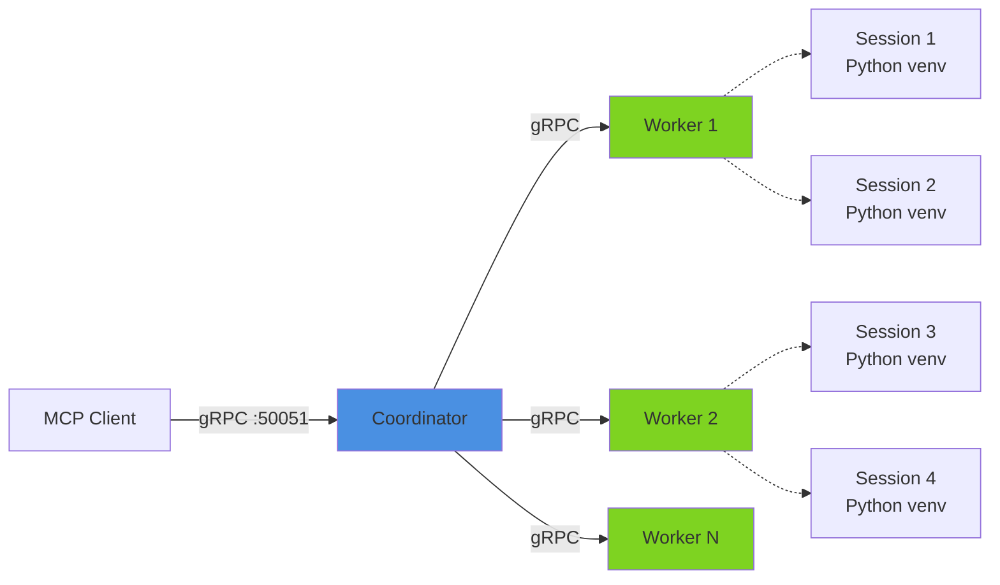
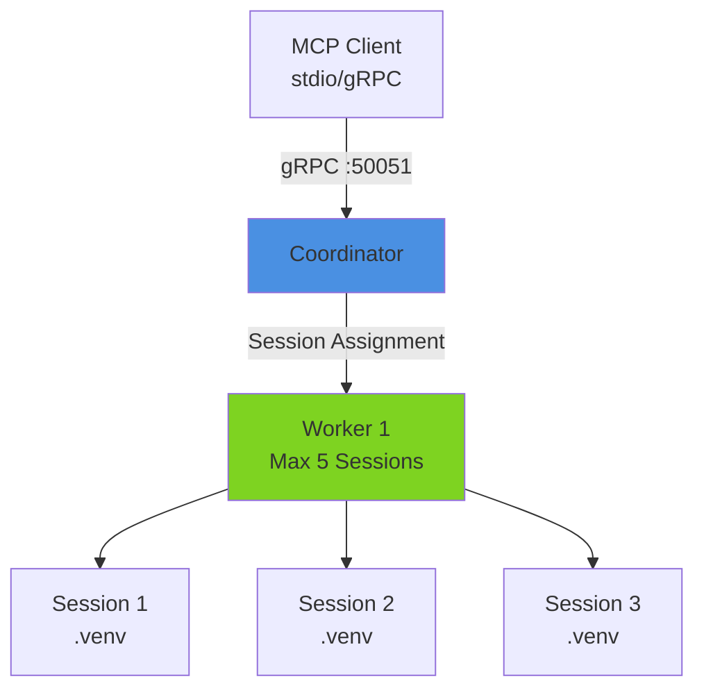
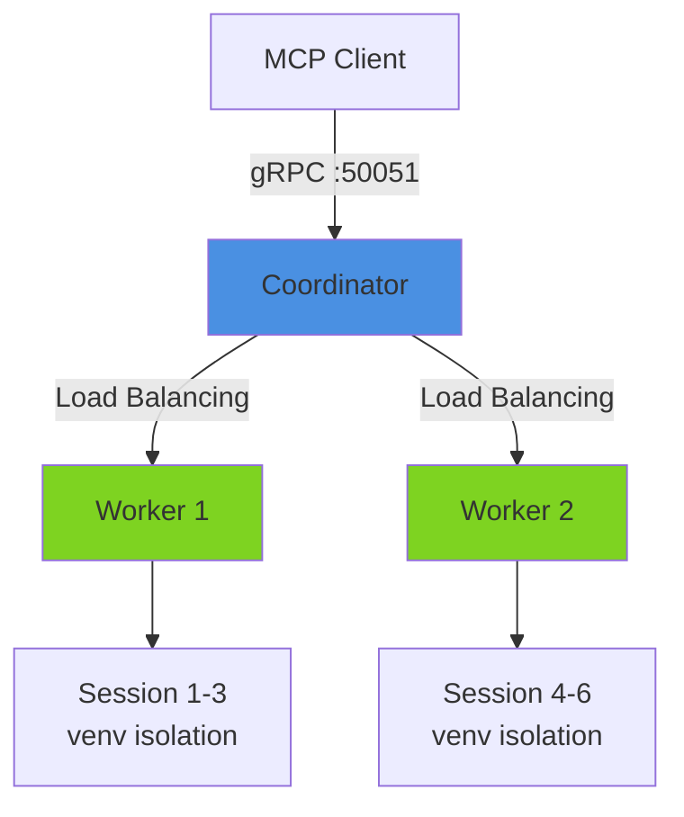
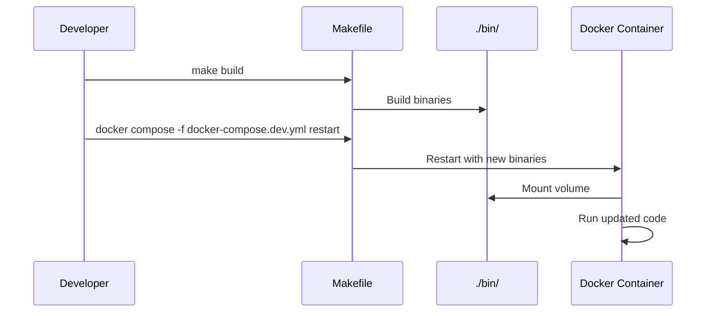
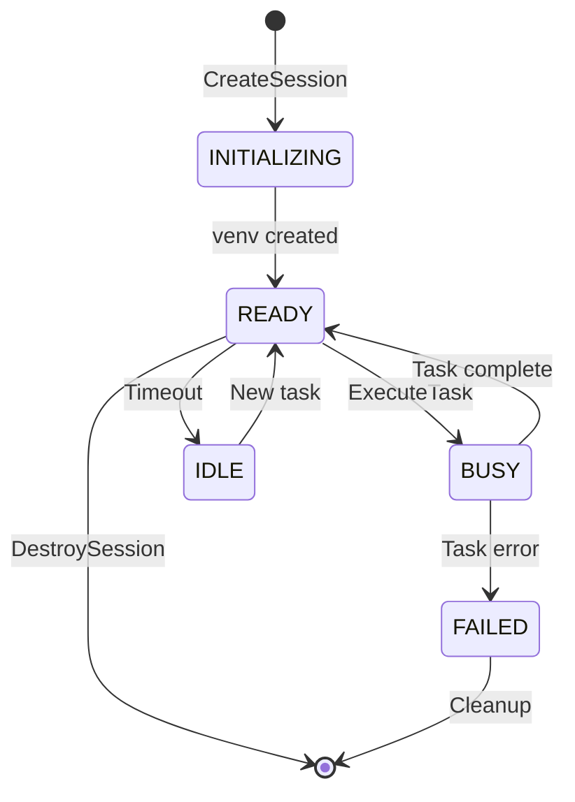

# Getting Started with Docker Compose

This guide walks you through deploying the CodeGen-MCP Worker-Coordinator system using Docker Compose.

## Overview

The CodeGen-MCP system consists of:

- **Coordinator**: Central orchestrator that manages sessions and routes tasks to workers
- **Workers**: Execute code in isolated Python virtual environments with multi-tenant session support



## Prerequisites

- Docker Engine 20.10+
- Docker Compose V2
- 4GB+ RAM recommended for multiple workers
- Go 1.25+ (for local development)

## Quick Start

### 1. Build the Images

```bash
# Build coordinator and worker images
make docker-build

# Or directly with docker compose
docker compose build
```

**Build time**: ~2-3 minutes (first build), ~15 seconds (subsequent builds)

**Image sizes**:
- Coordinator: ~201MB (minimal Debian with Go binary)
- Worker: ~1.05GB (Python 3.11 + development tools)

### 2. Start Services

```bash
# Start coordinator + 1 worker
make docker-up

# Or with docker compose
docker compose up -d
```

**Health check**: The coordinator will be marked healthy after ~5 seconds.

### 3. Verify Deployment

```bash
# Check service status
docker compose ps

# Expected output:
# NAME                  STATUS                    PORTS
# codegen-coordinator   Up (healthy)              0.0.0.0:50051->50051/tcp
# codegen-worker-1      Up                        50052/tcp
```

```bash
# Verify worker registration
docker compose logs worker-1 | grep "registered"

# Expected output:
# Successfully registered with coordinator
```

### 4. Run Integration Tests

```bash
# Test single-worker setup
make docker-test

# Test multi-worker setup (starts 2 workers)
make docker-test-multi
```

## Architecture Modes

### Single Worker (Development)



**Use case**: Local development, testing, debugging

```bash
docker compose up -d
```

### Multi-Worker (Production-like)



**Use case**: Production, load testing, high availability

```bash
# Start with 2 workers
docker compose --profile multi-worker up -d

# Or use make target
make docker-up-multi
```

## Configuration

### Environment Variables

#### Coordinator

| Variable | Default | Description |
|----------|---------|-------------|
| `GRPC_PORT` | `50051` | gRPC server port |
| `LOG_LEVEL` | `info` | Logging level (debug, info, warn, error) |

#### Worker

| Variable | Default | Description |
|----------|---------|-------------|
| `WORKER_ID` | `worker-1` | Unique worker identifier |
| `GRPC_PORT` | `50052` | Worker gRPC port (internal) |
| `MAX_SESSIONS` | `5` | Maximum concurrent sessions |
| `BASE_WORKSPACE` | `/home/builder/workspaces` | Workspace root directory |
| `COORDINATOR_ADDR` | `coordinator:50051` | Coordinator address |

### Customizing Configuration

Edit `docker-compose.yml`:

```yaml
services:
  worker-1:
    environment:
      - MAX_SESSIONS=10          # Increase capacity
      - LOG_LEVEL=debug          # Enable debug logging
```

## Development Workflow

### Fast Iteration with Dev Compose

The dev setup mounts pre-built binaries for rapid iteration:



**Workflow**:

```bash
# 1. Make code changes
vim internal/worker/session_pool.go

# 2. Rebuild binaries (fast)
make build

# 3. Restart containers with new binaries
docker compose -f docker-compose.dev.yml restart

# 4. Test changes
make docker-test
```

**Benefits**:
- No Docker rebuild required
- ~15 second iteration cycle
- Inspect workspaces in `./tmp/dev/worker-1/workspaces`

### Starting Dev Environment

```bash
# Start dev mode
make docker-up-dev

# Workspaces are mounted to:
# ./tmp/dev/worker-1/workspaces
# ./tmp/dev/worker-1/checkpoints
```

## Operational Tasks

### Viewing Logs

```bash
# All services
make docker-logs

# Specific service
docker compose logs -f coordinator
docker compose logs -f worker-1

# Search logs
docker compose logs | grep ERROR
```

### Inspecting Containers

```bash
# Open shell in worker
make docker-shell-worker

# Or directly
docker compose exec worker-1 bash

# Inside container:
ls -la /home/builder/workspaces
python3 --version
```

### Restarting Services

```bash
# Restart all services
make docker-restart

# Restart specific service
docker compose restart worker-1

# Restart just workers
make docker-restart-worker
```

### Scaling Workers

```bash
# Scale to 3 workers
docker compose up -d --scale worker-1=3

# Or define in docker-compose.yml:
services:
  worker-1:
    deploy:
      replicas: 3
```

### Cleanup

```bash
# Stop and remove containers
make docker-down

# Remove volumes (⚠️ deletes all session data)
make docker-clean

# Remove everything including images
make docker-clean-all
```

## Session Management

### Session Lifecycle



### Session Isolation

Each session gets:
- ✅ Isolated Python virtual environment (`.venv`)
- ✅ Isolated workspace directory
- ✅ Isolated package installations
- ✅ Resource limits enforcement

**Example**:

```bash
# Session 1 installs requests
docker compose exec worker-1 bash -c "
  cd /home/builder/workspaces/session-1
  .venv/bin/pip install requests
"

# Session 2 installs flask (isolated)
docker compose exec worker-1 bash -c "
  cd /home/builder/workspaces/session-2
  .venv/bin/pip install flask
"

# session-1 has requests, NOT flask
# session-2 has flask, NOT requests
```

## Testing

### Basic Health Check

```bash
# Test script runs automatically
./scripts/test-docker-integration.sh

# Checks:
# ✓ Services running
# ✓ Coordinator healthy
# ✓ Worker registered
# ✓ Python venv creation
# ✓ Package installation
```

### Multi-Worker Testing

```bash
# Start multi-worker environment
make docker-up-multi

# Run comprehensive tests
make docker-test-multi

# Tests:
# ✓ 2 workers registered
# ✓ 6 sessions distributed (3 per worker)
# ✓ Concurrent file operations
# ✓ Package isolation
```

## Troubleshooting

### Coordinator Not Healthy

**Symptom**: `codegen-coordinator` shows as unhealthy

```bash
docker compose logs coordinator
```

**Common causes**:
- Port 50051 already in use
- Network connectivity issues

**Solution**:
```bash
# Check port availability
lsof -i :50051

# Restart services
make docker-down && make docker-up
```

### Worker Not Registering

**Symptom**: Worker logs show connection errors

```bash
docker compose logs worker-1 | grep -i error
```

**Common causes**:
- Coordinator not ready yet
- Network configuration issues

**Solution**:
```bash
# Check coordinator is healthy first
docker compose ps coordinator

# Check network connectivity
docker compose exec worker-1 nc -zv coordinator 50051

# Restart worker
docker compose restart worker-1
```

### Python Package Installation Fails

**Symptom**: `pip install` fails in session

**Common causes**:
- Network connectivity
- pip not upgraded in venv

**Solution**:
```bash
# Exec into worker
make docker-shell-worker

# Upgrade pip manually
cd /home/builder/workspaces/session-id
.venv/bin/pip install --upgrade pip

# Test installation
.venv/bin/pip install requests
```

### Out of Disk Space

**Symptom**: Containers failing to start or execute tasks

```bash
# Check Docker disk usage
docker system df

# Clean up unused resources
docker system prune -a --volumes
```

**Prevention**:
```bash
# Regular cleanup of old checkpoints
docker compose exec worker-1 find /home/builder/.checkpoints -mtime +7 -delete
```

## Performance Tuning

### Worker Capacity

Adjust `MAX_SESSIONS` based on workload:

```yaml
# For CPU-intensive tasks
environment:
  - MAX_SESSIONS=3

# For I/O-bound tasks
environment:
  - MAX_SESSIONS=10
```

**Rule of thumb**: `MAX_SESSIONS = (Available CPU cores - 1) * 2`

### Resource Limits

Add Docker resource constraints:

```yaml
services:
  worker-1:
    deploy:
      resources:
        limits:
          cpus: '2.0'
          memory: 4G
        reservations:
          cpus: '1.0'
          memory: 2G
```

### Network Optimization

For high-throughput scenarios:

```yaml
networks:
  codegen-network:
    driver: bridge
    driver_opts:
      com.docker.network.driver.mtu: 1500
```

## Next Steps

- **[Coordinator API Reference](../coordinator/api-reference.md)**: gRPC service documentation
- **[Worker API Reference](../worker/api-reference.md)**: Worker implementation details
- **[Kubernetes Deployment](../deployment/kubernetes.md)**: Production deployment on K8s
- **[Development Guide](../development/setup.md)**: Contributing to the project

## Make Targets Reference

| Target | Description |
|--------|-------------|
| `make docker-build` | Build coordinator and worker images |
| `make docker-up` | Start coordinator + 1 worker |
| `make docker-up-dev` | Start with mounted binaries (dev mode) |
| `make docker-up-multi` | Start coordinator + 2 workers |
| `make docker-down` | Stop and remove containers |
| `make docker-logs` | Tail logs from all services |
| `make docker-ps` | Show container status |
| `make docker-restart` | Restart all services |
| `make docker-restart-worker` | Restart worker services only |
| `make docker-shell-worker` | Open bash in worker container |
| `make docker-shell-coordinator` | Open bash in coordinator container |
| `make docker-test` | Run integration tests |
| `make docker-test-multi` | Run multi-worker tests |
| `make docker-clean` | Remove volumes and temp files |
| `make docker-clean-all` | Remove images, volumes, and temp files |

## FAQ

**Q: How many workers should I run?**
A: Start with 1-2 workers for development. For production, scale based on workload: 1 worker per 5-10 concurrent sessions.

**Q: Can I run coordinator and workers on different hosts?**
A: Yes! Set `COORDINATOR_ADDR` to the coordinator's IP/hostname. Ensure firewall allows gRPC traffic on port 50051.

**Q: How do I persist session data across restarts?**
A: Volumes are automatically created (`worker-1-workspaces`, `worker-1-checkpoints`). Use checkpointing to save session state.

**Q: What's the difference between `docker-compose.yml` and `docker-compose.dev.yml`?**
A: Production builds images from source. Dev mode mounts pre-built binaries for faster iteration.

**Q: How do I upgrade to a new version?**
A: `make docker-down && git pull && make docker-build && make docker-up`
