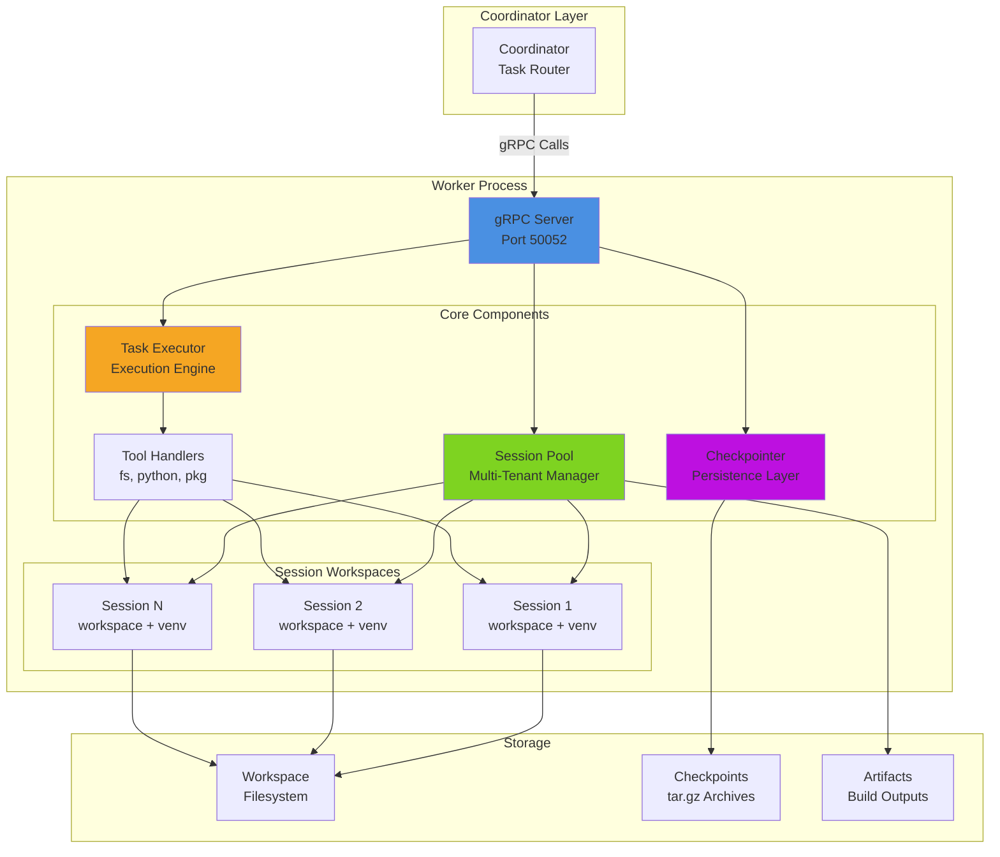
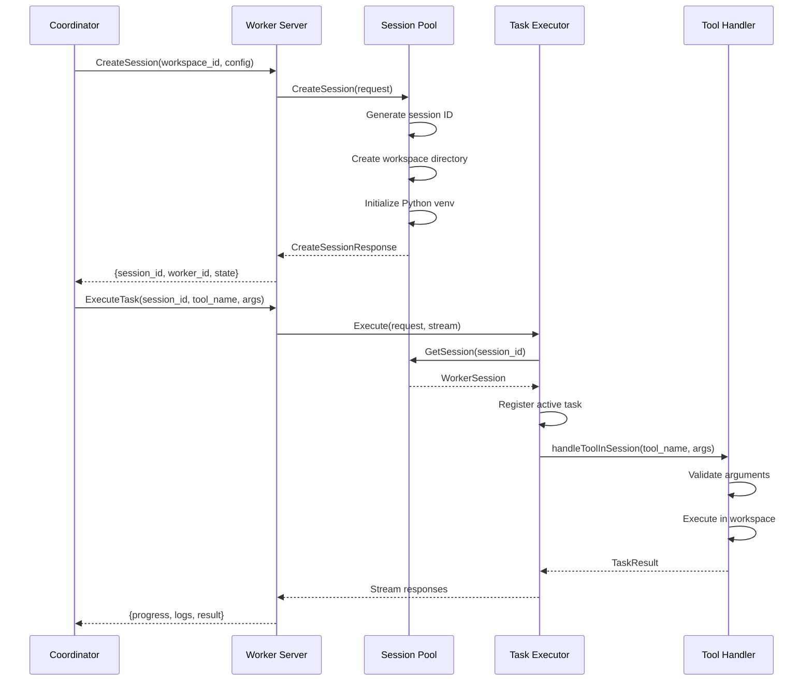
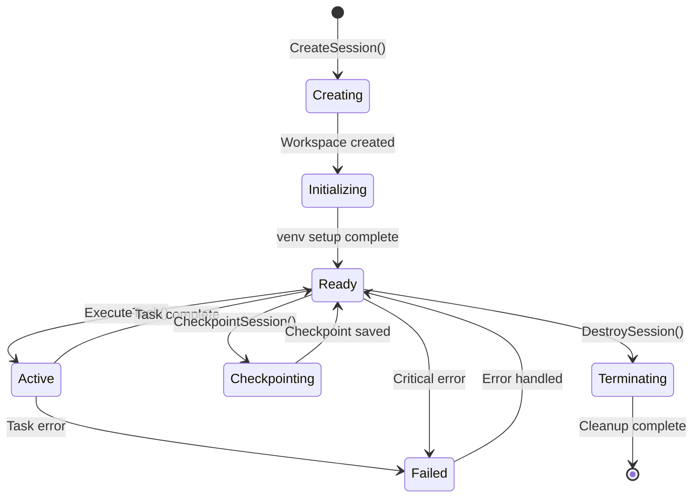
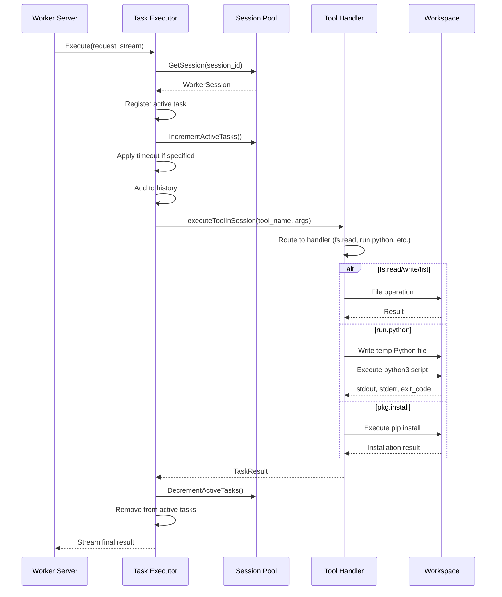
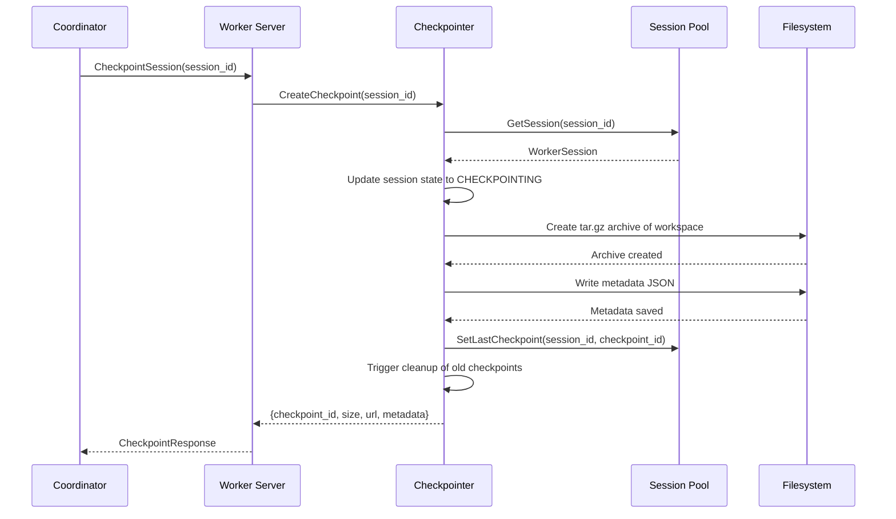
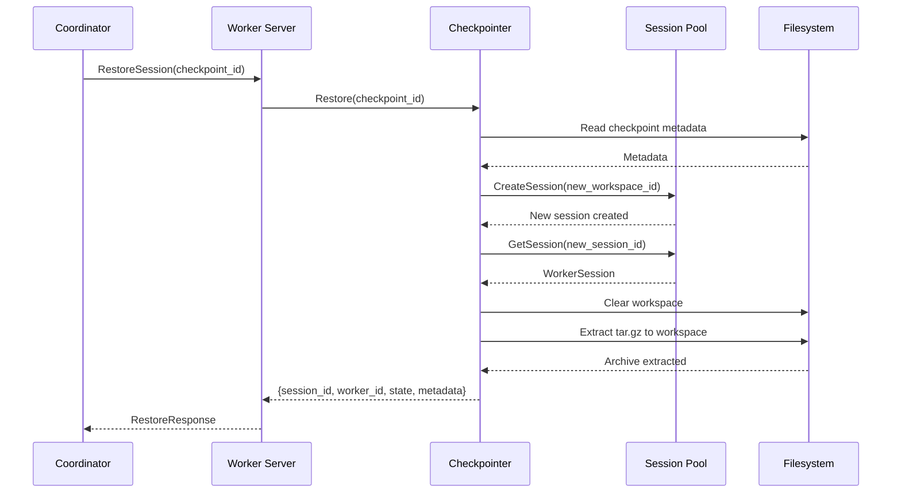

# Worker Architecture

The Worker is a stateful task execution component that provides isolated Python environments for secure code execution in the CodeGen-MCP system.

## Overview

The Worker acts as a gRPC server that:

- **Executes tasks** in multi-tenant isolated sessions
- **Manages Python environments** with automatic venv creation
- **Handles checkpointing** for session persistence and recovery
- **Streams execution results** with real-time progress updates
- **Enforces security** through workspace isolation and path validation
- **Tracks resources** per session for capacity management

## Architecture Diagram



## Component Details

### 1. Worker Server (`internal/worker/server.go`)

The Worker Server implements gRPC services for session management, task execution, and artifact handling.

**Key Responsibilities:**
- gRPC service implementation
- Request routing to appropriate handlers
- Session lifecycle management endpoints
- Task execution coordination
- Artifact management

**Implemented Services:**

```protobuf
service SessionManagement {
  rpc CreateSession(CreateSessionRequest) returns (CreateSessionResponse);
  rpc DestroySession(DestroySessionRequest) returns (DestroySessionResponse);
  rpc GetSessionStatus(SessionStatusRequest) returns (SessionStatusResponse);
  rpc CheckpointSession(CheckpointRequest) returns (CheckpointResponse);
  rpc RestoreSession(RestoreRequest) returns (RestoreResponse);
  rpc GetCapacity(CapacityRequest) returns (SessionCapacity);
}

service TaskExecution {
  rpc ExecuteTask(TaskRequest) returns (stream TaskResponse);
  rpc CancelTask(CancelRequest) returns (CancelResponse);
  rpc GetTaskStatus(StatusRequest) returns (StatusResponse);
}

service ArtifactService {
  rpc GetUploadURL(UploadURLRequest) returns (UploadURLResponse);
  rpc RecordArtifact(ArtifactMetadata) returns (ArtifactReceipt);
}
```

**Server Flow:**



### 2. Session Pool (`internal/worker/session_pool.go`)

Manages multi-tenant isolated sessions with capacity tracking.

**Key Responsibilities:**
- Session creation and destruction
- Workspace isolation per session
- Python venv initialization
- Activity tracking
- Capacity management
- Session metadata storage

**Session Structure:**

```go
type WorkerSession struct {
    SessionID        string
    WorkspaceID      string
    UserID           string
    WorkspacePath    string
    State            SessionState
    Config           *SessionConfig
    CreatedAt        time.Time
    LastActivity     time.Time
    ResourceUsage    *ResourceMetrics
    ActiveTasks      int32
    RecentTasks      []string
    LastCheckpointID string
    Artifacts        []string
    InstalledPkgs    []string
    mu               sync.RWMutex
}
```

**Session Lifecycle:**



**Key Methods:**

- `CreateSession(ctx, request)` - Create isolated session with workspace
- `DestroySession(sessionID)` - Clean up session and workspace
- `GetSession(sessionID)` - Retrieve session by ID
- `GetCapacity()` - Get current capacity information
- `UpdateSessionActivity(sessionID)` - Update last activity timestamp
- `IncrementActiveTasks(sessionID)` - Track active task count
- `initializePythonVenv(ctx, session)` - Set up Python environment

### 3. Task Executor (`internal/worker/task_executor.go`)

Executes tasks with streaming support, timeout handling, and cancellation.

**Key Responsibilities:**
- Task routing to tool handlers
- Active task tracking
- Timeout enforcement
- Cancellation support
- Progress streaming
- Error handling

**Execution Flow:**



**Active Task Management:**

```go
type ActiveTask struct {
    TaskID    string
    SessionID string
    ToolName  string
    StartTime time.Time
    Status    TaskStatus
    Cancel    context.CancelFunc
    mu        sync.RWMutex
}
```

**Key Methods:**

- `Execute(ctx, request, stream)` - Execute task with streaming
- `Cancel(ctx, request)` - Cancel running task
- `GetStatus(ctx, request)` - Get task status
- `executeToolInSession(tool, args, stream)` - Route to tool handler

### 4. Tool Handlers (`internal/worker/tool_handlers.go`)

Implements tool-specific logic for file operations, Python execution, and package management.

**Implemented Tools:**

#### Echo Tool
```go
// Test tool for connectivity
func handleEcho(ctx, session, request) TaskResult {
    message := request.Arguments["message"]
    return TaskResult{
        Status: STATUS_SUCCESS,
        Outputs: {"message": message},
    }
}
```

#### Filesystem Tools
```go
// Write file to workspace
func handleFsWrite(ctx, session, request) TaskResult {
    path := validateWorkspacePath(request.Arguments["path"])
    contents := request.Arguments["contents"]
    
    fullPath := filepath.Join(session.WorkspacePath, path)
    os.MkdirAll(filepath.Dir(fullPath), 0755)
    os.WriteFile(fullPath, []byte(contents), 0644)
    
    return TaskResult{Status: STATUS_SUCCESS, Outputs: {...}}
}

// Read file from workspace
func handleFsRead(ctx, session, request) TaskResult {
    path := validateWorkspacePath(request.Arguments["path"])
    fullPath := filepath.Join(session.WorkspacePath, path)
    data, err := os.ReadFile(fullPath)
    
    return TaskResult{
        Status: STATUS_SUCCESS,
        Outputs: {"contents": string(data), "size": len(data)},
    }
}

// List directory contents
func handleFsList(ctx, session, request) TaskResult {
    path := validateWorkspacePath(request.Arguments["path"])
    fullPath := filepath.Join(session.WorkspacePath, path)
    entries, err := os.ReadDir(fullPath)
    
    return TaskResult{
        Status: STATUS_SUCCESS,
        Outputs: {"entries": entryNames},
    }
}
```

#### Python Execution
```go
// Execute Python code
func handleRunPython(ctx, session, request, stream) TaskResult {
    code := request.Arguments["code"]
    
    // Create temp Python file
    tmpFile := filepath.Join(session.WorkspacePath, ".tmp_<timestamp>.py")
    os.WriteFile(tmpFile, []byte(code), 0644)
    defer os.Remove(tmpFile)
    
    // Use venv Python if available, else system python
    pythonCmd := session.WorkspacePath + "/.venv/bin/python3"
    if _, err := os.Stat(pythonCmd); err != nil {
        pythonCmd = "python3"
    }
    
    // Execute with streaming output
    cmd := exec.CommandContext(ctx, pythonCmd, tmpFile)
    cmd.Dir = session.WorkspacePath
    cmd.Env = append(os.Environ(), "PYTHONPATH=" + session.WorkspacePath)
    
    output, err := cmd.CombinedOutput()
    stream.Send(ProgressUpdate{...})
    
    return TaskResult{
        Status: STATUS_SUCCESS,
        Outputs: {"stdout": stdout, "stderr": stderr, "exit_code": exitCode},
    }
}
```

#### Package Installation
```go
// Install Python packages
func handlePkgInstall(ctx, session, request, stream) TaskResult {
    requirements := request.Arguments["requirements"]
    pkgList := strings.Split(requirements, "\n")
    
    // Use venv pip if available
    pipCmd := session.WorkspacePath + "/.venv/bin/pip"
    if _, err := os.Stat(pipCmd); err != nil {
        pipCmd = "pip3"
    }
    
    // Execute pip install
    args := append([]string{"install"}, pkgList...)
    cmd := exec.CommandContext(ctx, pipCmd, args...)
    cmd.Dir = session.WorkspacePath
    
    output, err := cmd.CombinedOutput()
    stream.Send(ProgressUpdate{...})
    
    return TaskResult{
        Status: STATUS_SUCCESS,
        Outputs: {"installed": pkgList, "stdout": output},
    }
}
```

**Path Validation:**

```go
func validateWorkspacePath(path string) error {
    // Reject absolute paths
    if filepath.IsAbs(path) {
        return errors.New("absolute paths not allowed")
    }
    
    // Reject directory traversal
    if strings.Contains(path, "..") {
        return errors.New("directory traversal not allowed")
    }
    
    // Clean path
    cleanPath := filepath.Clean(path)
    return nil
}
```

### 5. Checkpointer (`internal/worker/checkpointer.go`)

Handles session persistence through checkpoint creation and restoration.

**Key Responsibilities:**
- Create tar.gz archives of session workspaces
- Store checkpoint metadata (packages, files, config)
- Restore sessions from checkpoints
- Cleanup old checkpoints
- Archive compression/decompression

**Checkpoint Structure:**

```
.checkpoints/
├── checkpoint-session1-1699564800.tar.gz    # Compressed workspace
├── checkpoint-session1-1699564800.json      # Metadata
├── checkpoint-session1-1699651200.tar.gz
├── checkpoint-session1-1699651200.json
└── ...
```

**Checkpoint Metadata:**

```json
{
  "session_id": "session-abc123",
  "workspace_path": "/workspaces/session-abc123",
  "created_at": "2025-11-08T10:30:00Z",
  "installed_packages": ["requests", "flask"],
  "modified_files": ["src/main.py", "requirements.txt"],
  "session_config": {
    "language": "python",
    "limits": {
      "max_memory_mb": 512,
      "max_cpu_percent": 80
    }
  }
}
```

**Checkpoint Flow:**



**Restore Flow:**



**Key Methods:**

- `CreateCheckpoint(ctx, sessionID, incremental)` - Create checkpoint archive
- `Restore(ctx, request)` - Restore session from checkpoint
- `Checkpoint(ctx, request)` - Public API for checkpointing
- `createArchive(sourceDir, targetPath)` - Create tar.gz archive
- `extractArchive(archivePath, targetDir)` - Extract tar.gz archive
- `cleanupOldCheckpoints(sessionID)` - Remove old checkpoints

**Archive Implementation (Refactored for Complexity):**

The archive functions were refactored to reduce cognitive complexity:

```go
// Main archive creation (calls helpers)
func createArchive(sourceDir, targetPath) error
func addFileToArchive(tarWriter, sourceDir, path, info) error
func createTarHeader(sourceDir, path, info) (*tar.Header, error)
func copyFileToArchive(tarWriter, path) error

// Main extraction (calls helpers)
func extractArchive(archivePath, targetDir) error
func openArchiveReader(archivePath) (*tar.Reader, func(), error)
func extractFileFromArchive(tarReader, targetDir, header) error
func extractDirectory(targetPath) error
func extractRegularFile(tarReader, targetPath, header) error
```

## Security Model

### Session Isolation

Each session operates in complete isolation:

- **Filesystem:** Separate workspace directory per session
- **Python Environment:** Isolated venv with separate packages
- **Process Isolation:** Each Python execution runs in separate process
- **Resource Tracking:** Per-session CPU, memory, disk usage

### Path Validation

All file operations go through strict validation:

```go
// Validation rules:
✅ Relative paths only (no absolute paths)
✅ No directory traversal (no ".." components)
✅ Workspace scoping (all paths within session workspace)
✅ Path cleaning (resolve symlinks, normalize separators)
❌ Absolute paths: /etc/passwd
❌ Traversal: ../../etc/passwd
❌ Hidden traversal: foo/../../../etc/passwd
```

### Execution Safety

Python code execution safety measures:

- **Timeout Protection:** Configurable task timeouts
- **Process Isolation:** Separate process per execution
- **Environment Control:** Limited environment variables
- **Workspace Scoping:** PYTHONPATH restricted to workspace
- **Cancellation Support:** Tasks can be cancelled mid-execution

### Resource Limits

Per-session resource tracking and limits:

- **Active Tasks:** Maximum concurrent tasks per session
- **Workspace Size:** Disk usage monitoring
- **Memory Usage:** Per-session memory tracking (reported)
- **CPU Usage:** Per-session CPU tracking (reported)
- **Task History:** Limited history to prevent memory growth

## Configuration

### Session Pool Configuration

```go
type SessionPoolConfig struct {
    WorkerID       string  // Unique worker identifier
    MaxSessions    int32   // Maximum concurrent sessions
    BaseWorkspace  string  // Base workspace directory
    MaxRecentTasks int     // Tasks to keep in history
}
```

### Session Configuration

```go
type SessionConfig struct {
    Language string              // "python" | "node" | "go"
    Limits   *ResourceLimits     // Resource constraints
    Env      map[string]string   // Environment variables
}

type ResourceLimits struct {
    MaxMemoryMB    int32   // Memory limit in MB
    MaxCPUPercent  int32   // CPU percentage limit
    MaxDiskMB      int32   // Disk space limit in MB
    TimeoutSeconds int32   // Task timeout in seconds
}
```

### Checkpointer Configuration

```go
type CheckpointerConfig struct {
    BaseWorkspace  string  // Base workspace path
    CheckpointDir  string  // Checkpoint storage directory
    MaxCheckpoints int     // Checkpoints to keep per session
}
```

## Capacity Management

### Session Capacity

Workers report capacity information:

```go
type SessionCapacity struct {
    TotalSessions     int32           // Maximum sessions
    ActiveSessions    int32           // Current sessions
    AvailableSessions int32           // Remaining capacity
    Sessions          []*SessionInfo  // Active session details
}
```

### Load Balancing

Coordinators can use capacity information for load balancing:

1. Query multiple workers with `GetCapacity()`
2. Select worker with most available capacity
3. Create session on selected worker
4. Track worker load across requests

## Error Handling

### Error Types

```go
// Session errors
ErrSessionNotFound        = "session not found"
ErrSessionCapacityFull    = "session pool at capacity"
ErrSessionInitFailed      = "failed to initialize session"

// Task errors
ErrTaskNotFound          = "task not found"
ErrTaskTimeout           = "task execution timeout"
ErrTaskCancelled         = "task was cancelled"

// Tool errors
ErrInvalidPath           = "invalid workspace path"
ErrFileNotFound          = "file not found"
ErrPythonNotFound        = "python3 not found in PATH"
ErrPackageInstallFailed  = "package installation failed"

// Checkpoint errors
ErrCheckpointNotFound    = "checkpoint not found"
ErrArchiveCreationFailed = "failed to create archive"
ErrArchiveExtractionFailed = "failed to extract archive"
```

### Error Propagation

Errors are propagated through gRPC status codes:

- `OK` - Success
- `NOT_FOUND` - Session/task/checkpoint not found
- `INVALID_ARGUMENT` - Invalid request parameters
- `RESOURCE_EXHAUSTED` - Capacity exceeded
- `DEADLINE_EXCEEDED` - Task timeout
- `CANCELLED` - Task cancelled by client
- `INTERNAL` - Internal server error

## Performance Considerations

### Session Creation

Session creation includes:
- Workspace directory creation (~5ms)
- Python venv initialization (~500ms-2s)
- Metadata initialization (~1ms)

**Optimization:** Create sessions proactively during idle time

### Task Execution

Task execution overhead:
- Task registration (~1ms)
- Session lookup (~1ms)
- Tool routing (~1ms)
- Actual execution (variable)
- Result streaming (~5ms)

**Optimization:** Keep sessions warm, reuse Python processes

### Checkpointing

Checkpoint performance depends on workspace size:
- Small workspace (10MB): ~200ms
- Medium workspace (100MB): ~1-2s
- Large workspace (1GB): ~10-20s

**Optimization:** Use incremental checkpoints, compress in background

### Concurrent Operations

The Worker handles concurrent operations efficiently:
- **Session Operations:** RWMutex for safe concurrent access
- **Active Tasks:** Mutex-protected map for task tracking
- **Streaming:** Goroutine per stream, non-blocking sends
- **Cleanup:** Background goroutines for checkpoint cleanup

## Monitoring and Observability

### Metrics (Planned)

Key metrics to expose:

```
worker_sessions_total          # Total sessions created
worker_sessions_active         # Current active sessions
worker_sessions_capacity       # Maximum session capacity
worker_tasks_total             # Total tasks executed
worker_tasks_active            # Current running tasks
worker_task_duration_seconds   # Task execution time
worker_checkpoint_size_bytes   # Checkpoint archive sizes
worker_workspace_size_bytes    # Session workspace sizes
```

### Logging

Structured logging at key points:

```go
log.Info("session created",
    "session_id", session.SessionID,
    "workspace_id", session.WorkspaceID,
    "user_id", session.UserID,
)

log.Info("task executed",
    "session_id", sessionID,
    "task_id", taskID,
    "tool_name", toolName,
    "duration_ms", duration,
    "status", result.Status,
)

log.Info("checkpoint created",
    "session_id", sessionID,
    "checkpoint_id", checkpointID,
    "size_bytes", size,
    "duration_ms", duration,
)
```

### Health Checks

Health check endpoints (planned):

- `/health/liveness` - Is the worker running?
- `/health/readiness` - Can the worker accept new sessions?
- `/health/capacity` - Current capacity status

## Extension Points

### Custom Tool Handlers

Add new tools by implementing handler functions:

```go
func (te *TaskExecutor) handleCustomTool(
    ctx context.Context,
    session *WorkerSession,
    req *protov1.TaskRequest,
    stream protov1.TaskExecution_ExecuteTaskServer,
) (*protov1.TaskResult, error) {
    // Implement tool logic
    // Stream progress updates
    // Return result
}

// Register in executeToolInSession
case "custom.tool":
    return te.handleCustomTool(ctx, session, req, stream)
```

### Custom Session Initializers

Extend session initialization:

```go
func (sp *SessionPool) initializeCustomEnvironment(
    ctx context.Context,
    session *WorkerSession,
) error {
    // Initialize custom environment
    // Install dependencies
    // Configure tools
}
```

### Custom Checkpoint Formats

Extend checkpointing with custom formats:

```go
func (c *Checkpointer) createCustomCheckpoint(
    sessionID string,
    format string,
) (string, error) {
    // Create checkpoint in custom format
    // Store metadata
    // Return checkpoint ID
}
```

## Future Enhancements

### Short Term

- Resource limit enforcement (memory, CPU)
- WebSocket streaming support
- Health check endpoints
- Prometheus metrics
- Container restart on session creation

### Medium Term

- S3/cloud storage for checkpoints
- Kubernetes Job integration
- Test execution framework
- Multi-language support (Node.js, Go)
- GPU support for ML workloads

### Long Term

- Distributed session management
- Cross-worker session migration
- Container-in-container support
- Advanced scheduling algorithms
- Multi-region deployment

## See Also

- [API Reference](./api-reference.md) - Complete API documentation
- [Deployment Guide](./deployment.md) - Production deployment patterns
- [Testing Guide](./testing.md) - Testing strategies and examples
- [Coordinator](../coordinator/) - Central orchestration component

## References

- [gRPC Go](https://grpc.io/docs/languages/go/) - gRPC documentation
- [Protocol Buffers](https://protobuf.dev/) - Protobuf documentation
- [Go Best Practices](https://go.dev/doc/effective_go) - Go programming guide
