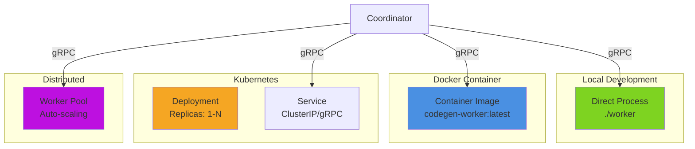

# Worker Deployment Guide

Guide for deploying the CodeGen-MCP Worker in various environments.

## Deployment Patterns

The Worker supports multiple deployment patterns depending on your infrastructure:



## Local Development

### Direct Execution

The simplest deployment for development:

```bash
# Build the worker
make build

# Run with default settings
./bin/worker

# Run with custom port
./bin/worker --port 50053

# Run with debug logging
./bin/worker --debug
```

**Configuration:**

| Environment Variable | Default | Description |
|---------------------|---------|-------------|
| `WORKER_PORT` | `50052` | gRPC server port |
| `WORKER_ID` | `worker-{hostname}` | Worker identifier |
| `LOG_LEVEL` | `info` | Logging level (debug, info, warn, error) |
| `MAX_SESSIONS` | `10` | Maximum concurrent sessions |
| `SESSION_TIMEOUT` | `30m` | Session inactivity timeout |
| `WORKSPACE_ROOT` | `/tmp/workspaces` | Workspace directory |
| `CHECKPOINT_DIR` | `/tmp/checkpoints` | Checkpoint storage |

### Verifying Installation

```bash
# Check worker status
grpcurl -plaintext localhost:50052 list

# Create test session
grpcurl -plaintext -d '{"workspace_id":"test-workspace"}' \
  localhost:50052 protov1.SessionManagement/CreateSession

# Get capacity
grpcurl -plaintext localhost:50052 \
  protov1.SessionManagement/GetCapacity
```

### Docker Compose

For local development with coordinator:

```yaml
# docker-compose.yml
version: '3.8'

services:
  coordinator:
    build:
      context: .
      dockerfile: docker/coordinator/Dockerfile
    ports:
      - "8080:8080"
    environment:
      - LOG_LEVEL=debug
      - WORKER_URLS=worker-1:50052,worker-2:50052
    networks:
      - codegen-net

  worker-1:
    build:
      context: .
      dockerfile: docker/builder/Dockerfile
      target: worker
    environment:
      - WORKER_ID=worker-1
      - WORKER_PORT=50052
      - LOG_LEVEL=debug
      - MAX_SESSIONS=10
    volumes:
      - worker1-workspaces:/tmp/workspaces
      - worker1-checkpoints:/tmp/checkpoints
    networks:
      - codegen-net

  worker-2:
    build:
      context: .
      dockerfile: docker/builder/Dockerfile
      target: worker
    environment:
      - WORKER_ID=worker-2
      - WORKER_PORT=50052
      - LOG_LEVEL=debug
      - MAX_SESSIONS=10
    volumes:
      - worker2-workspaces:/tmp/workspaces
      - worker2-checkpoints:/tmp/checkpoints
    networks:
      - codegen-net

volumes:
  worker1-workspaces:
  worker1-checkpoints:
  worker2-workspaces:
  worker2-checkpoints:

networks:
  codegen-net:
    driver: bridge
```

**Start services:**

```bash
docker-compose up -d
docker-compose logs -f worker-1 worker-2
docker-compose ps

# Scale workers
docker-compose up -d --scale worker-1=3
```

## Docker Deployment

### Dockerfile

```dockerfile
# docker/builder/Dockerfile
FROM golang:1.23-alpine AS builder

WORKDIR /build

# Install dependencies
RUN apk add --no-cache git make

# Copy source
COPY go.mod go.sum ./
RUN go mod download

COPY . .

# Build worker binary
RUN make build-worker

# Runtime stage
FROM alpine:3.19

# Install Python and system dependencies
RUN apk add --no-cache \
    python3 \
    py3-pip \
    py3-virtualenv \
    ca-certificates \
    git

# Create non-root user
RUN addgroup -g 1000 worker && \
    adduser -D -u 1000 -G worker worker

# Create directories
RUN mkdir -p /tmp/workspaces /tmp/checkpoints && \
    chown -R worker:worker /tmp/workspaces /tmp/checkpoints

# Copy binary
COPY --from=builder /build/bin/worker /usr/local/bin/worker

# Switch to non-root user
USER worker

WORKDIR /home/worker

# Expose gRPC port
EXPOSE 50052

# Health check
HEALTHCHECK --interval=30s --timeout=3s --start-period=5s --retries=3 \
  CMD grpcurl -plaintext localhost:50052 list || exit 1

CMD ["/usr/local/bin/worker"]
```

### Building Image

```bash
# Build worker image
docker build -f docker/builder/Dockerfile -t codegen-worker:latest .

# Build with version tag
docker build -f docker/builder/Dockerfile -t codegen-worker:v0.1.0 .

# Multi-platform build
docker buildx build \
  --platform linux/amd64,linux/arm64 \
  -t codegen-worker:latest \
  -f docker/builder/Dockerfile .
```

### Running Container

```bash
# Run single worker
docker run -d \
  --name worker-1 \
  -p 50052:50052 \
  -e WORKER_ID=worker-1 \
  -e MAX_SESSIONS=20 \
  -v worker-workspaces:/tmp/workspaces \
  -v worker-checkpoints:/tmp/checkpoints \
  codegen-worker:latest

# Run with resource limits
docker run -d \
  --name worker-1 \
  -p 50052:50052 \
  --memory="4g" \
  --cpus="2" \
  -e MAX_SESSIONS=10 \
  codegen-worker:latest

# View logs
docker logs -f worker-1

# Check status
docker exec worker-1 ps aux
docker stats worker-1
```

## Kubernetes Deployment

### Deployment Manifest

```yaml
# k8s/worker-deployment.yaml
apiVersion: apps/v1
kind: Deployment
metadata:
  name: codegen-worker
  namespace: codegen-mcp
  labels:
    app: worker
    version: v0.1.0
spec:
  replicas: 3
  strategy:
    type: RollingUpdate
    rollingUpdate:
      maxSurge: 1
      maxUnavailable: 0
  selector:
    matchLabels:
      app: worker
  template:
    metadata:
      labels:
        app: worker
        version: v0.1.0
      annotations:
        prometheus.io/scrape: "true"
        prometheus.io/port: "9090"
    spec:
      serviceAccountName: worker
      securityContext:
        runAsNonRoot: true
        runAsUser: 1000
        fsGroup: 1000
      containers:
      - name: worker
        image: codegen-worker:v0.1.0
        imagePullPolicy: IfNotPresent
        ports:
        - name: grpc
          containerPort: 50052
          protocol: TCP
        - name: metrics
          containerPort: 9090
          protocol: TCP
        env:
        - name: WORKER_ID
          valueFrom:
            fieldRef:
              fieldPath: metadata.name
        - name: WORKER_PORT
          value: "50052"
        - name: LOG_LEVEL
          value: "info"
        - name: MAX_SESSIONS
          value: "20"
        - name: SESSION_TIMEOUT
          value: "30m"
        - name: WORKSPACE_ROOT
          value: "/workspaces"
        - name: CHECKPOINT_DIR
          value: "/checkpoints"
        resources:
          requests:
            cpu: 500m
            memory: 1Gi
          limits:
            cpu: 2000m
            memory: 4Gi
        volumeMounts:
        - name: workspaces
          mountPath: /workspaces
        - name: checkpoints
          mountPath: /checkpoints
        livenessProbe:
          exec:
            command:
            - grpcurl
            - -plaintext
            - localhost:50052
            - list
          initialDelaySeconds: 10
          periodSeconds: 30
          timeoutSeconds: 5
        readinessProbe:
          exec:
            command:
            - grpcurl
            - -plaintext
            - -d
            - '{}'
            - localhost:50052
            - protov1.SessionManagement/GetCapacity
          initialDelaySeconds: 5
          periodSeconds: 10
          timeoutSeconds: 3
      volumes:
      - name: workspaces
        emptyDir:
          sizeLimit: 10Gi
      - name: checkpoints
        persistentVolumeClaim:
          claimName: worker-checkpoints
---
apiVersion: v1
kind: PersistentVolumeClaim
metadata:
  name: worker-checkpoints
  namespace: codegen-mcp
spec:
  accessModes:
  - ReadWriteMany
  storageClassName: nfs-client
  resources:
    requests:
      storage: 50Gi
```

### Service Manifest

```yaml
# k8s/worker-service.yaml
apiVersion: v1
kind: Service
metadata:
  name: codegen-worker
  namespace: codegen-mcp
  labels:
    app: worker
spec:
  type: ClusterIP
  selector:
    app: worker
  ports:
  - name: grpc
    port: 50052
    targetPort: 50052
    protocol: TCP
  - name: metrics
    port: 9090
    targetPort: 9090
    protocol: TCP
  sessionAffinity: ClientIP
  sessionAffinityConfig:
    clientIP:
      timeoutSeconds: 3600
```

### Horizontal Pod Autoscaler

```yaml
# k8s/worker-hpa.yaml
apiVersion: autoscaling/v2
kind: HorizontalPodAutoscaler
metadata:
  name: codegen-worker
  namespace: codegen-mcp
spec:
  scaleTargetRef:
    apiVersion: apps/v1
    kind: Deployment
    name: codegen-worker
  minReplicas: 2
  maxReplicas: 10
  metrics:
  - type: Resource
    resource:
      name: cpu
      target:
        type: Utilization
        averageUtilization: 70
  - type: Resource
    resource:
      name: memory
      target:
        type: Utilization
        averageUtilization: 80
  - type: Pods
    pods:
      metric:
        name: worker_active_sessions
      target:
        type: AverageValue
        averageValue: "15"
  behavior:
    scaleDown:
      stabilizationWindowSeconds: 300
      policies:
      - type: Percent
        value: 10
        periodSeconds: 60
    scaleUp:
      stabilizationWindowSeconds: 60
      policies:
      - type: Percent
        value: 50
        periodSeconds: 60
      - type: Pods
        value: 2
        periodSeconds: 60
      selectPolicy: Max
```

### ConfigMap

```yaml
# k8s/worker-config.yaml
apiVersion: v1
kind: ConfigMap
metadata:
  name: worker-config
  namespace: codegen-mcp
data:
  worker.yaml: |
    server:
      port: 50052
      max_sessions: 20
      session_timeout: 30m
    
    workspace:
      root: /workspaces
      max_size_mb: 1024
    
    checkpoint:
      dir: /checkpoints
      compression: gzip
      retention_days: 7
    
    resources:
      max_memory_mb: 512
      max_cpu_percent: 80
      timeout_seconds: 300
    
    logging:
      level: info
      format: json
```

### Deploy to Kubernetes

```bash
# Create namespace
kubectl create namespace codegen-mcp

# Apply configurations
kubectl apply -f k8s/worker-config.yaml
kubectl apply -f k8s/worker-deployment.yaml
kubectl apply -f k8s/worker-service.yaml
kubectl apply -f k8s/worker-hpa.yaml

# Verify deployment
kubectl get pods -n codegen-mcp -l app=worker
kubectl get svc -n codegen-mcp codegen-worker
kubectl get hpa -n codegen-mcp codegen-worker

# View logs
kubectl logs -n codegen-mcp -l app=worker --tail=100 -f

# Get worker status
kubectl exec -n codegen-mcp deployment/codegen-worker -- \
  grpcurl -plaintext localhost:50052 \
  protov1.SessionManagement/GetCapacity
```

## Production Configuration

### Environment Variables

```bash
# Worker Identity
export WORKER_ID="worker-prod-01"
export WORKER_PORT="50052"

# Session Management
export MAX_SESSIONS="50"
export SESSION_TIMEOUT="1h"

# Resource Limits
export MAX_MEMORY_MB="512"
export MAX_CPU_PERCENT="80"
export TASK_TIMEOUT_SECONDS="600"

# Storage Paths
export WORKSPACE_ROOT="/data/workspaces"
export CHECKPOINT_DIR="/data/checkpoints"

# Logging
export LOG_LEVEL="info"
export LOG_FORMAT="json"

# Monitoring
export METRICS_PORT="9090"
export HEALTH_CHECK_PORT="8081"

# Security
export TLS_CERT="/etc/certs/tls.crt"
export TLS_KEY="/etc/certs/tls.key"
export TLS_CA="/etc/certs/ca.crt"
```

### Resource Sizing

**Small Worker (Development):**
- CPU: 500m-1000m
- Memory: 1-2 GB
- Max Sessions: 5-10
- Disk: 10 GB

**Medium Worker (Production):**
- CPU: 1000m-2000m
- Memory: 2-4 GB
- Max Sessions: 10-20
- Disk: 50 GB

**Large Worker (High Load):**
- CPU: 2000m-4000m
- Memory: 4-8 GB
- Max Sessions: 20-50
- Disk: 100 GB

### Storage Configuration

**Workspace Storage (Ephemeral):**
```yaml
volumes:
- name: workspaces
  emptyDir:
    sizeLimit: 10Gi
    medium: Memory  # Use RAM for better performance
```

**Checkpoint Storage (Persistent):**
```yaml
volumes:
- name: checkpoints
  persistentVolumeClaim:
    claimName: worker-checkpoints

# PVC with NFS/EFS for shared access
apiVersion: v1
kind: PersistentVolumeClaim
metadata:
  name: worker-checkpoints
spec:
  accessModes:
  - ReadWriteMany
  storageClassName: nfs-client
  resources:
    requests:
      storage: 100Gi
```

### Security Hardening

```yaml
# Security Context
securityContext:
  runAsNonRoot: true
  runAsUser: 1000
  runAsGroup: 1000
  fsGroup: 1000
  readOnlyRootFilesystem: true
  allowPrivilegeEscalation: false
  capabilities:
    drop:
    - ALL

# Pod Security Policy
apiVersion: policy/v1beta1
kind: PodSecurityPolicy
metadata:
  name: worker-psp
spec:
  privileged: false
  allowPrivilegeEscalation: false
  requiredDropCapabilities:
  - ALL
  volumes:
  - 'emptyDir'
  - 'persistentVolumeClaim'
  - 'secret'
  - 'configMap'
  runAsUser:
    rule: 'MustRunAsNonRoot'
  seLinux:
    rule: 'RunAsAny'
  fsGroup:
    rule: 'MustRunAs'
    ranges:
    - min: 1000
      max: 65535
```

## Monitoring

### Metrics

Expose Prometheus metrics on port 9090:

```yaml
- name: metrics
  containerPort: 9090
```

**Available Metrics:**
- `worker_active_sessions` - Current session count
- `worker_capacity_total` - Maximum sessions
- `worker_capacity_available` - Available slots
- `worker_task_duration_seconds` - Task execution time
- `worker_checkpoint_size_bytes` - Checkpoint sizes
- `worker_session_age_seconds` - Session age distribution

### Health Checks

```yaml
livenessProbe:
  exec:
    command:
    - grpcurl
    - -plaintext
    - localhost:50052
    - list
  initialDelaySeconds: 10
  periodSeconds: 30

readinessProbe:
  exec:
    command:
    - grpcurl
    - -plaintext
    - -d
    - '{}'
    - localhost:50052
    - protov1.SessionManagement/GetCapacity
  initialDelaySeconds: 5
  periodSeconds: 10
```

### Logging

Configure structured logging:

```go
// JSON logging for production
{
  "timestamp": "2024-01-15T10:30:00Z",
  "level": "info",
  "worker_id": "worker-prod-01",
  "session_id": "session-abc123",
  "message": "Session created successfully",
  "duration_ms": 150
}
```

## Troubleshooting

### Common Issues

**1. Sessions Not Starting**

```bash
# Check workspace permissions
kubectl exec -n codegen-mcp deployment/codegen-worker -- \
  ls -la /workspaces

# Check Python availability
kubectl exec -n codegen-mcp deployment/codegen-worker -- \
  python3 --version

# View detailed logs
kubectl logs -n codegen-mcp -l app=worker --tail=200
```

**2. Capacity Exhausted**

```bash
# Check current capacity
grpcurl -plaintext localhost:50052 \
  protov1.SessionManagement/GetCapacity

# Scale up workers
kubectl scale deployment codegen-worker -n codegen-mcp --replicas=5

# Or adjust MAX_SESSIONS
kubectl set env deployment/codegen-worker \
  -n codegen-mcp MAX_SESSIONS=30
```

**3. Checkpoint Failures**

```bash
# Check checkpoint directory
kubectl exec -n codegen-mcp deployment/codegen-worker -- \
  ls -lh /checkpoints

# Check disk space
kubectl exec -n codegen-mcp deployment/codegen-worker -- \
  df -h /checkpoints

# Verify PVC
kubectl get pvc -n codegen-mcp worker-checkpoints
```

**4. High Memory Usage**

```bash
# Check per-pod metrics
kubectl top pods -n codegen-mcp -l app=worker

# Adjust memory limits
kubectl set resources deployment/codegen-worker \
  -n codegen-mcp \
  --limits=memory=6Gi \
  --requests=memory=3Gi
```

### Debug Commands

```bash
# Get worker status
grpcurl -plaintext localhost:50052 list

# List all sessions
grpcurl -plaintext localhost:50052 \
  protov1.SessionManagement/GetCapacity

# Create test session
grpcurl -plaintext -d '{"workspace_id":"debug-test"}' \
  localhost:50052 protov1.SessionManagement/CreateSession

# Check session status
grpcurl -plaintext -d '{"session_id":"session-123"}' \
  localhost:50052 protov1.SessionManagement/GetSessionStatus

# Execute test task
grpcurl -plaintext -d '{
  "task_id": "test-123",
  "session_id": "session-123",
  "tool_name": "echo",
  "arguments": {"message": "test"}
}' localhost:50052 protov1.TaskExecution/ExecuteTask
```

## See Also

- [Architecture Overview](./README.md) - System design and components
- [API Reference](./api-reference.md) - Complete API documentation
- [Testing Guide](./testing.md) - Testing strategies
- [Kubernetes Best Practices](https://kubernetes.io/docs/concepts/configuration/overview/) - K8s documentation
- [Docker Best Practices](https://docs.docker.com/develop/dev-best-practices/) - Docker documentation
