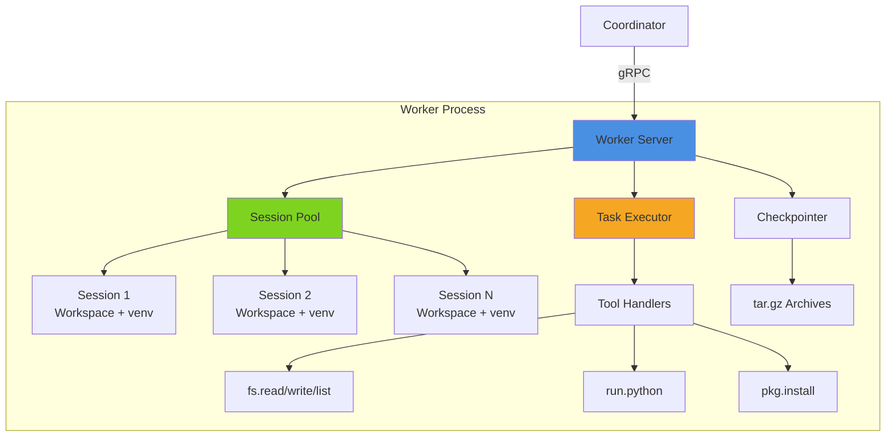

# Worker Documentation

Complete documentation for the CodeGen-MCP Worker component.

## Quick Links

- **[Architecture Overview](./README.md)** - High-level architecture, components, and design
- **[API Reference](./api-reference.md)** - Complete API documentation and usage examples
- **[Deployment Guide](./deployment.md)** - Deploy to production (Docker, Kubernetes, etc.)
- **[Testing Guide](./testing.md)** - Testing strategies and best practices

## What is the Worker?

The Worker is a stateful task execution component that provides isolated Python environments for secure code execution. It:

- **Executes tasks** in isolated session workspaces
- **Manages Python environments** with venv support
- **Handles checkpointing** for session persistence and recovery
- **Provides artifact storage** for build outputs
- **Enforces resource limits** per session
- **Streams execution logs** in real-time

## Getting Started

### Prerequisites

- Go 1.25 or later
- Python 3.8+ (for Python execution support)
- Docker (for containerized deployments)
- Kubernetes (for production deployments)

### Quick Start

```bash
# Clone the repository
git clone https://github.com/AltairaLabs/codegen-mcp.git
cd codegen-mcp

# Build the worker
make build-worker

# Run locally (defaults to port 50052)
./bin/worker

# Run with custom configuration
./bin/worker --port 50053 --max-sessions 10 --workspace /tmp/worker-workspace
```

### Docker

```bash
# Build container image
docker build -f docker/worker/Dockerfile -t codegen-mcp/worker:latest .

# Run container
docker run -p 50052:50052 -v /tmp/workspaces:/workspaces codegen-mcp/worker:latest

# Run with environment variables
docker run -e MAX_SESSIONS=10 -e BASE_WORKSPACE=/workspaces codegen-mcp/worker:latest
```

### Kubernetes

```bash
# Deploy to cluster
kubectl apply -f k8s/worker-deployment.yaml
kubectl apply -f k8s/worker-service.yaml

# Check status
kubectl get pods -l app=worker

# Scale workers
kubectl scale deployment worker --replicas=5
```

## Architecture at a Glance



## Core Features

### Session Management

- **Multi-Tenant Isolation:** Each session has isolated workspace and Python venv
- **Capacity Management:** Configurable maximum sessions per worker
- **Activity Tracking:** Last activity timestamps and task history
- **Resource Usage:** Memory and CPU tracking per session
- **Automatic Cleanup:** Stale sessions removed automatically

### Task Execution

- **Streaming Support:** Real-time progress updates and logs
- **Timeout Handling:** Configurable task timeouts
- **Cancellation:** Cancel running tasks gracefully
- **Error Propagation:** Detailed error messages with stack traces
- **Tool Routing:** Dynamic tool dispatch based on tool name

### Checkpointing

- **Session Persistence:** Save session state to disk
- **Archive Format:** tar.gz compression for efficiency
- **Metadata Tracking:** Session config, packages, modified files
- **Restore Support:** Recreate sessions from checkpoints
- **Cleanup Policy:** Keep last N checkpoints per session

### Python Support

- **Virtual Environments:** Isolated venv per session
- **Package Management:** Install packages via pip
- **Code Execution:** Run Python scripts with streaming output
- **Environment Variables:** Custom PYTHONPATH and environment setup
- **Fallback Support:** System Python if venv not initialized

## Available Tools

Current tools implemented in the Worker:

| Tool | Description | Arguments | Returns |
|------|-------------|-----------|---------|
| `echo` | Echo message (test tool) | `message: string` | `message: string` |
| `fs.write` | Write file to workspace | `path: string, contents: string` | `path: string, bytes_written: int` |
| `fs.read` | Read file from workspace | `path: string` | `path: string, contents: string, size: int` |
| `fs.list` | List directory contents | `path: string` | `entries: []string` |
| `run.python` | Execute Python code | `code: string` | `stdout: string, stderr: string, exit_code: int` |
| `pkg.install` | Install Python packages | `requirements: string` | `installed: []string, stdout: string` |

See [API Reference](./api-reference.md) for detailed API documentation.

## Documentation Structure

### [Architecture Overview](./README.md)

Comprehensive architecture documentation including:

- Component diagram and data flow
- Session pool implementation
- Task executor design
- Checkpointing mechanism
- Security model
- Configuration options

**Recommended for:** Understanding the system design

### [API Reference](./api-reference.md)

Complete API documentation covering:

- gRPC service definitions
- Session management APIs
- Task execution APIs
- Checkpoint/restore APIs
- Artifact management APIs
- Type definitions and examples

**Recommended for:** Developers integrating or extending the Worker

### [Deployment Guide](./deployment.md)

Production deployment patterns:

- Local development setup
- Docker containerization
- Kubernetes manifests
- Scaling strategies
- Resource limits and tuning
- Monitoring and observability

**Recommended for:** DevOps and platform engineers

### [Testing Guide](./testing.md)

Testing strategies and coverage:

- Unit test examples
- Integration tests
- Checkpoint/restore tests
- Performance benchmarks
- CI/CD integration
- Coverage improvement strategies

**Recommended for:** Developers contributing to the project

## Project Status

### Current Version: v0.1.0

**Test Coverage:** 83.9% (target: 90%)

| Component | Coverage |
|-----------|----------|
| server.go | 100% ✅ |
| session_pool.go | 87.5% |
| task_executor.go | 85.3% |
| tool_handlers.go | 86.2% |
| checkpointer.go | 81.4% |

**Build Status:** ✅ All tests passing

### Implemented Features

- ✅ gRPC server with streaming support
- ✅ Multi-tenant session pool
- ✅ Six core tools (echo, fs.*, run.python, pkg.install)
- ✅ Task execution with cancellation
- ✅ Checkpoint/restore functionality
- ✅ Python venv management
- ✅ Streaming logs and progress
- ✅ Artifact management
- ✅ Resource tracking

### Planned Features

- ⏳ Resource limit enforcement (CPU, memory)
- ⏳ Kubernetes Job integration
- ⏳ S3/cloud storage for checkpoints
- ⏳ WebSocket streaming support
- ⏳ Test execution framework
- ⏳ Container-in-container support
- ⏳ GPU support for ML workloads
- ⏳ Distributed tracing

## Configuration

### Environment Variables

| Variable | Default | Description |
|----------|---------|-------------|
| `WORKER_ID` | `worker-1` | Unique worker identifier |
| `GRPC_PORT` | `50052` | gRPC server port |
| `MAX_SESSIONS` | `5` | Maximum concurrent sessions |
| `BASE_WORKSPACE` | `/tmp/workspaces` | Base directory for session workspaces |
| `LOG_LEVEL` | `info` | Logging level (debug, info, warn, error) |
| `CHECKPOINT_DIR` | `<workspace>/.checkpoints` | Checkpoint storage directory |
| `MAX_CHECKPOINTS` | `10` | Checkpoints to keep per session |

### Command-Line Flags

```bash
--version           # Print version and exit
--port 50052        # gRPC server port
--max-sessions 5    # Maximum concurrent sessions
--workspace /path   # Base workspace directory
```

## Performance Characteristics

### Session Operations

- **Create Session:** ~50ms (includes venv creation)
- **Destroy Session:** ~100ms (includes cleanup)
- **Get Status:** <1ms
- **Checkpoint Session:** ~200ms (depends on workspace size)
- **Restore Session:** ~300ms (depends on archive size)

### Task Execution

- **Echo Tool:** <1ms
- **fs.read:** ~5ms (for small files)
- **fs.write:** ~10ms (for small files)
- **run.python:** Variable (depends on code complexity)
- **pkg.install:** Variable (depends on package size)

### Resource Usage

- **Memory per Session:** ~50MB (base) + venv size
- **Disk per Session:** ~100MB (base) + installed packages
- **CPU per Task:** Variable based on workload

## Security Model

### Session Isolation

- **Filesystem:** Each session has isolated workspace directory
- **Python Environment:** Isolated venv per session
- **Process Isolation:** Separate Python processes per execution
- **Network:** Controlled access to external resources

### Path Validation

- **Relative Paths Only:** No absolute paths allowed
- **No Directory Traversal:** `..` components rejected
- **Workspace Scoping:** All operations within session workspace
- **Symlink Protection:** Symlinks outside workspace blocked

### Resource Limits

- **Timeout Protection:** Tasks have configurable timeouts
- **Active Task Limits:** Maximum concurrent tasks per session
- **Workspace Size:** Monitored and can be limited
- **Memory Limits:** Per-session memory caps (planned)

## Contributing

Contributions welcome! Please:

1. Read [CONTRIBUTING.md](../../CONTRIBUTING.md)
2. Check existing issues and PRs
3. Follow testing guidelines in [Testing Guide](./testing.md)
4. Ensure 85%+ test coverage for new code
5. Update documentation as needed

## Support

- **Issues:** [GitHub Issues](https://github.com/AltairaLabs/codegen-mcp/issues)
- **Discussions:** [GitHub Discussions](https://github.com/AltairaLabs/codegen-mcp/discussions)
- **Documentation:** [docs/worker/](.)

## Related Components

- **[Coordinator](../coordinator/)** - Central orchestration component
- **[MCP Protocol](https://spec.modelcontextprotocol.io/)** - Protocol specification

## License

Apache 2.0 - See [LICENSE](../../LICENSE) for details

Copyright © 2025 AltairaLabs.ai
